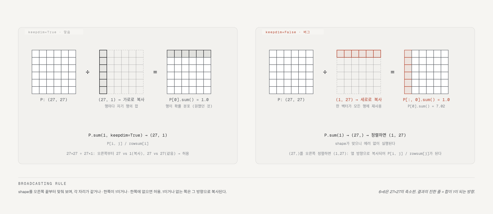

# makemore 1: bigram, 언어 모델링의 뼈대

- 강의: Andrej Karpathy, [The spelled-out intro to language modeling: building makemore](https://www.youtube.com/watch?v=PaCmpygFfXo) (2022-09, 1h57m). Zero to Hero 시리즈 2편.
- 코드: 강의에서 타이핑한 노트북 [nn-zero-to-hero/lectures/makemore/makemore_part1_bigrams.ipynb](https://github.com/karpathy/nn-zero-to-hero/blob/master/lectures/makemore/makemore_part1_bigrams.ipynb) (커밋 `73c3fcc`, 60셀). 데이터 `names.txt`와 완성본 `makemore.py`는 [karpathy/makemore](https://github.com/karpathy/makemore) (MIT, 커밋 `988aa59` 2022-11-20)에 있다. 강의는 `makemore.py`를 열지 않고 노트북만 만든다. 저장소의 `Bigram` 클래스는 [@sec-diff]에서 대조한다.
- 정리 방식: 노트북의 핵심 계산을 별도 스크립트로 재구성해 이 서버에서 실행하고(Python 3.9, torch 2.8.0 CPU) 출력을 기록했다. 본문의 수치는 그 실행 결과다. 공개된 노트북은 셀 실행 순서와 저장된 출력이 어긋난 곳이 있어(예: cell 18이 아직 정의되지 않은 `P.shape`를 평가) 셀을 그대로 순서대로 돌릴 수는 없다. 강의에서 말한 값과 다른 곳은 그렇게 적었다. 특히 `torch.multinomial`의 난수는 같은 seed라도 torch 버전에 따라 달라서, 이 노트의 샘플 이름은 노트북·영상과 다르다([@sec-sampling] 참조). 강의 설명은 자동 생성 영어 자막(3,332줄)을 바탕으로 했고 화면(PyTorch 문서 페이지, 그래프)은 보지 못했다.
- 검수: 초안을 Claude 서브에이전트와 Codex CLI가 독립적으로 자막·노트북·저장소 코드와 대조해 리뷰했고, 지적을 근거로 판정해 반영했다.
- 이 노트의 코드 블록에서 `# 각주:`로 시작하는 주석과 셀 출력을 옮겨 적은 주석(`# tensor([...])`, `# 32033` 등)은 정리자가 단 것이고, 나머지 주석은 원본이다. 셀 여러 개를 합치거나 출력 줄을 줄인 블록이 있다. `cell N`은 노트북의 0부터 세는 셀 인덱스다.

## 공식 자료 (영상 설명란)

- [makemore 저장소](https://github.com/karpathy/makemore) · [강의 노트북](https://github.com/karpathy/nn-zero-to-hero/blob/master/lectures/makemore/makemore_part1_bigrams.ipynb)
- 연습용 링크: [CS231n Python/NumPy 튜토리얼](https://cs231n.github.io/python-numpy-tutorial/) (broadcasting과 dtype 설계가 torch와 거의 같다고 설명란이 권한다), [PyTorch Tensor 튜토리얼](https://pytorch.org/tutorials/beginner/basics/tensorqs_tutorial.html), [PyTorch NLP 입문의 Tensor 절](https://pytorch.org/tutorials/beginner/nlp/pytorch_tutorial.html)
- 연습문제 E01–E06이 설명란에 있다. [@sec-exercises]에 옮기고 일부는 풀었다.
- 공식 챕터 24개가 설명란에 있다. 아래 절의 시간은 그 챕터를 따른다.

## 한 줄 요약

언어 모델은 "앞 글자들이 주어졌을 때 다음 글자의 확률 분포"를 내는 것이고, 학습·샘플링·평가(loss)라는 틀은 모델이 아무리 커져도 그대로다. 이 강의는 그 틀을 가장 작은 모델인 bigram(앞 글자 하나 → 다음 글자)으로 두 번 만든다. 한 번은 27×27 표에 bigram 횟수를 **세어서** 행을 정규화하고, 한 번은 같은 표를 **가중치 행렬 W로 두고** negative log likelihood(NLL)의 기울기로 배운다. 두 결과는 거의 같은 모델이다(데이터 loss 2.454 vs 2.475). 카파시가 신경망 쪽을 굳이 만든 이유는, 앞 글자가 열 개가 되면 표는 불가능하지만 "logits → softmax → NLL → backward"라는 기계는 Transformer까지 그대로 쓰이기 때문이다.

## 강의 구조와 코드 대응

| 시간 | 주제 | 노트북 | minimind 대응 |
|---|---|---|---|
| 0:00–0:03 | makemore 소개. 문자 단위 언어 모델 | — | `MiniMindForCausalLM` (토큰 단위) |
| 0:03–0:12 | `names.txt` 탐색, bigram 뽑기, dict로 세기 | cell 0–6 | — |
| 0:12–0:24 | 27×27 `torch.tensor`로 세기, 시각화, `<S>`/`<E>`를 `.` 하나로 | cell 7–11 | tokenizer의 특수 토큰 (`<|im_start|>` 등) |
| 0:24–0:36 | 행을 확률로 바꿔 `torch.multinomial`로 샘플링 | cell 12–17, 24 | `generate()`의 `torch.multinomial` |
| 0:36–0:50 | 행 정규화의 벡터화, broadcasting, keepdim 버그 | cell 18–23 | — |
| 0:50–1:03 | likelihood → log → NLL → 평균. smoothing | cell 25–26 | `F.cross_entropy` |
| 1:03–1:26 | 신경망 버전: (x, y) 데이터셋, one-hot, `xenc @ W`, softmax | cell 27–45 | `embed_tokens`, `lm_head`, softmax |
| 1:26–1:35 | 요약. 무작위 W의 loss와 최적화 동기 | cell 46 | — |
| 1:35–1:43 | 벡터화된 loss, `backward()`, 갱신 | cell 47–54 | `train_pretrain.py`의 학습 루프 |
| 1:43–1:56 | 전체 데이터로 학습, one-hot = 행 선택, regularization ≈ smoothing, 샘플링 | cell 55–58 | AdamW의 weight decay |

---

## makemore가 무엇인가 (0:00–0:03) {#sec-intro}

makemore는 "준 것을 더 만드는" 프로그램이다. `names.txt`(정부 사이트에서 모은 이름 32,033개)로 학습하면 이름처럼 들리지만 실제로는 없는 이름을 만든다. 강의가 보여준 예시 생성은 자막 인식으로 "Dontal, Irot, Zendy" 같은 것들이다(철자는 확실하지 않다. 저장소 README의 예시 목록에는 "dontell"이 있다).

내부적으로 makemore는 **문자 단위 언어 모델**이다. 각 줄(이름)을 하나의 예제로 보고, 그 안의 글자 순서를 모델링해 "다음 글자"를 예측한다. 시리즈 전체의 계획도 여기서 나온다. bigram과 bag of words, MLP, RNN, 그리고 Transformer까지, 모두 "다음 글자 예측"이라는 같은 문제를 푸는 다른 신경망이고, 마지막 Transformer는 GPT-2와 같은 구조다. 그 뒤에는 단어 단위, 이미지(DALL-E, Stable Diffusion)까지 "아마" 가겠다고 한다. 실제 시리즈는 문자 단위 GPT, tokenizer(minbpe), GPT-2 재현으로 이어졌고 단어 단위·이미지 편은 없다(정리자 확인: nn-zero-to-hero 저장소 README, 커밋 `73c3fcc`).

::: {.callout-note title="minimind 대응"}
minimind는 문자가 아니라 BPE 토큰 단위(`vocab_size` 6400, `model/model_minimind.py:18`)이고, 앞 토큰 하나가 아니라 attention으로 여러 앞 토큰을 함께 보지만, 문제의 형식은 같다. 앞 토큰들이 주어졌을 때 다음 토큰의 분포를 내고, `torch.multinomial`로 하나를 뽑아 이어 붙인다(`generate()`, `model_minimind.py:278`. `do_sample=True`일 때. 아니면 argmax). 이 노트의 27은 minimind의 6400에 해당한다.
:::

## 데이터셋과 bigram (0:03–0:12) {#sec-data}

```python
words = open('names.txt', 'r').read().splitlines()   # 각주: 파일 전체를 한 문자열로 읽고 줄 단위로 잘라 리스트로
words[:10]      # ['emma', 'olivia', 'ava', 'isabella', 'sophia', 'charlotte', 'mia', 'amelia', 'harper', 'evelyn']
len(words)      # 32033
min(len(w) for w in words), max(len(w) for w in words)   # (2, 15)
```

카파시는 앞부분 이름을 보고 "빈도순으로 정렬된 것 같다"고 추측만 한다(파일은 알파벳순이 아니다. 확인 결과 `words == sorted(words)`는 False).

이름 하나에 예제가 여러 개 들어 있다는 것이 첫 번째 관찰이다. "isabella"는 i가 첫 글자로 올 만하다는 것, i 다음에 s가 온다는 것, …, 그리고 **"isabella" 다음에는 이름이 끝난다**는 것까지 알려준다. 이 마지막 정보를 놓치지 않으려면 끝을 나타내는 특수 토큰이 필요하다.

bigram 모델은 이 중 가장 약한 것으로, 앞 글자 하나만 보고 다음 글자를 예측한다. 그 전의 글자는 모두 잊는다.

```python
b = {}
for w in words:
  chs = ['<S>'] + list(w) + ['<E>']     # 각주: list('emma') = ['e','m','m','a']. 앞뒤에 시작·끝 토큰을 "환각"시켜 붙임
  for ch1, ch2 in zip(chs, chs[1:]):    # 각주: zip(chs, chs[1:])는 (chs[0],chs[1]), (chs[1],chs[2]), … 짧은 쪽이 끝나면 멈춘다
    bigram = (ch1, ch2)
    b[bigram] = b.get(bigram, 0) + 1     # 각주: 키가 없으면 0에서 시작. dict로 세기
```

`sorted(b.items(), key=lambda kv: -kv[1])`로 정렬하면 가장 흔한 bigram은 `('n','<E>')` 6763회, `('a','<E>')` 6640회, `('a','n')` 5438회, `('<S>','a')` 4410회 순이다(bigram 종류는 627개). 강의는 여기서 "n은 이름 끝에 아주 자주 오고, n은 거의 항상 a 뒤에 온다"는 정도만 읽는다. 뒤쪽은 과장이다. a는 n의 가장 흔한 앞 글자이지만 비율은 5438/18327, 약 30%다(정리자 확인). 강의에서 정렬 방향을 바꾸기 전 화면 아래쪽에 보인 1회짜리 bigram은 자막상 "QNR"과 "DZ"인데 앞의 것은 오인식으로 보인다(정리자 추정).

## 27×27 텐서로 세기 (0:12–0:24) {#sec-count-tensor}

dict 대신 2차원 배열에 세면 다음 단계(정규화, 샘플링)가 훨씬 편하다. 행은 앞 글자, 열은 다음 글자다. 카파시는 자막에서 "how often that first character follows the second character"라고 말하지만 이는 말실수이고, 코드 `N[ix1, ix2] += 1`은 "ix1 다음에 ix2가 온 횟수"다.

PyTorch를 여기서 처음 쓴다. `torch.zeros((3,5))`로 shape을 보이고, 기본 dtype이 `float32`(단정밀도 실수)라는 것과 정수 카운트에는 `dtype=torch.int32`를 쓴다는 것, `a[1,3] = 1`처럼 인덱싱해 쓴다는 것을 보인다.

```python
import torch
N = torch.zeros((27, 27), dtype=torch.int32)     # 각주: 처음 영상에서는 <S>,<E> 두 토큰으로 28×28을 만들었다가 아래처럼 27로 고친다

chars = sorted(list(set(''.join(words))))         # 각주: 모든 이름을 한 문자열로 잇고 set으로 중복 제거 → 26자, 정렬
stoi = {s:i+1 for i,s in enumerate(chars)}        # 각주: string-to-index. a→1, …, z→26. +1은 0번을 특수 토큰에 주기 위해
stoi['.'] = 0                                     # 각주: 시작과 끝을 겸하는 특수 토큰 '.' 하나만 둔다
itos = {i:s for s,i in stoi.items()}              # 각주: 역방향 매핑. 샘플링 결과를 글자로 되돌릴 때 씀

for w in words:
  chs = ['.'] + list(w) + ['.']
  for ch1, ch2 in zip(chs, chs[1:]):
    ix1 = stoi[ch1]
    ix2 = stoi[ch2]
    N[ix1, ix2] += 1                              # 각주: (앞 글자, 다음 글자) 칸을 1 올림. 이것이 "학습"의 전부
```

### 왜 `<S>`, `<E>` 대신 `.` 하나인가

28×28 버전을 시각화하면 `<E>` 행 전체와 `<S>` 열 전체가 0이다. `<E>`는 절대 bigram의 앞 글자가 될 수 없고 `<S>`는 절대 뒤 글자가 될 수 없기 때문이다. 2×2 특수 토큰 블록에서 0이 아닐 수 있는 칸은 빈 이름일 때의 `<S><E>` 하나뿐이다(자막에서는 "S follows E"라고 거꾸로 말한다). 공간 낭비이기도 하고 그림이 붐빈다. 그래서 특수 토큰을 `.` 하나로 합치고 인덱스 0에 둔다. 시작 토큰과 끝 토큰을 하나로 합쳐도 되는 이유는 위치가 구분해 주기 때문이다. 0번 행(`.` 다음)은 첫 글자 분포, 0번 열(`.` 앞)은 마지막 글자 분포가 된다. `N[0,0]`, 즉 `..`는 빈 이름이 없으므로 0이다.

`<S>`, `<E>`처럼 꺾쇠를 쓴 것은 NLP 관례를 따른 것이라고 카파시가 덧붙인다.

::: {.callout-note title="minimind 대응"}
minimind tokenizer는 시작·끝을 구분한다. `<|im_start|>`, `<|im_end|>`가 그것이고 `generate()`는 `eos_token_id=2`가 나오면 그 시퀀스를 끝난 것으로 표시하고 배치 전부가 끝나면 루프를 멈춘다(`model_minimind.py:257, 283–285`). 역할은 이 강의의 `.`와 같다. 모델이 "여기서 끝"이라는 것을 배우고 말할 수 있어야 한다.
:::

{#fig-counts}

시각화 코드(cell 11)에서 배울 것은 `N[i, j].item()`이다. 텐서를 인덱싱하면 값이 하나여도 여전히 `torch.tensor`이고, `.item()`이 Python 숫자를 꺼낸다.

## 샘플링 (0:24–0:36) {#sec-sampling}

이 표만 있으면 이름을 만들 수 있다. 시작은 항상 `.`이므로 0번 행에서 첫 글자를 뽑고, 뽑힌 글자의 행에서 다음 글자를 뽑고, `.`이 나오면 멈춘다.

```python
p = N[0].float()                 # 각주: N[0]은 N[0, :]와 같다. 이후 계산을 실수로 하도록 명시적으로 변환 (정수 텐서에 제자리 /= 를 하면 에러)
p = p / p.sum()                  # 각주: 합이 1인 확률 벡터. p[1]=0.1377 (a로 시작할 확률), p[13]=0.0792 (m)

g = torch.Generator().manual_seed(2147483647)     # 각주: 난수 생성기를 고정해 누구나 같은 결과를 보게
ix = torch.multinomial(p, num_samples=1, replacement=True, generator=g).item()
itos[ix]
```

`torch.multinomial`은 확률 벡터를 주면 그 확률대로 정수 인덱스를 뽑아 준다. `replacement=True`가 없으면 기본값이 False라서 한 번 뽑은 인덱스를 다시 뽑지 않으니 주의하라고 한다. 카파시는 이를 3원소 예제로 먼저 확인한다. `torch.rand(3, generator=g)`를 정규화하면 `[0.6064, 0.3033, 0.0903]`이고, 여기서 100개를 뽑으면(강의는 20개로 시작하고 노트북 최종본이 100개) 0이 61개, 1이 33개, 2가 6개다. 대략 60:30:10이다.

**재현되지 않는 것.** 이 첫 샘플이 강의와 노트북에서는 인덱스 13 `m`인데, 이 서버(torch 2.8)에서는 인덱스 3 `c`다. `torch.rand`의 세 값은 정확히 같고, 위의 `num_samples=100` 결과도 노트북 cell 16의 100개와 원소까지 같다. 달라진 것은 `num_samples=1` 경로뿐이므로, 그 경로가 난수를 소비하는 방식이 torch 버전 사이에 바뀐 것으로 보인다(정리자 추정, 릴리스 노트로 확인하지는 못했다). 따라서 아래 샘플 이름은 강의의 "mor., axx., minaymoryles., kondlaisah., anchshizarie."와 다르다. 어느 쪽이든 유효한 샘플이고, 뒤에서 중요한 것은 "같은 seed로 counting 모델과 신경망 모델이 같은 이름을 내는가"이다.

```python
P = (N+1).float()                # 각주: 노트북 최종본(cell 23). +1은 smoothing (뒤 절). 강의 이 시점의 코드는 N.float()이고, 이 데이터에서는 둘의 샘플이 같다
P /= P.sum(1, keepdims=True)     # 각주: 각 행을 자기 합으로 나눠 27개의 확률 분포를 미리 만들어 둔다. 제자리 연산

g = torch.Generator().manual_seed(2147483647)
for i in range(5):
  out = []
  ix = 0                                       # 각주: 항상 '.'(시작)에서 출발
  while True:
    p = P[ix]                                  # 각주: 현재 글자의 행 = 다음 글자 분포. 영상 처음엔 여기서 매번 N[ix].float()/합을 다시 계산했다
    ix = torch.multinomial(p, num_samples=1, replacement=True, generator=g).item()
    out.append(itos[ix])
    if ix == 0:                                # 각주: '.'이 뽑히면 이름 끝
      break
  print(''.join(out))
```

이 서버 출력: `cexze.`, `momasurailezitynn.`, `konimittain.`, `llayn.`, `ka.`. 카파시 표현으로 "끔찍하다". 20개를 뽑아 보면 `da.`, `ke.`, `br.` 같은 두 글자짜리와 `staiyaubrtthrigotai.` 같은 것이 섞인다. 모델 입장에서 보면 당연하다. `h` 다음에 `.`이 올 확률은 꽤 높고, 모델은 그 `h`가 이름의 첫 글자라는 것을 모른다.

그래도 학습이 되었는지 확인하려면 학습 안 한 모델과 비교하면 된다. 루프 안의 `p = P[ix]`를 `p = torch.ones(27)/27`(균등 분포)로 바꾸면 `zoglkurkicqzktyhwmvmzimjttainrlkfukzkktda.` 같은 것이 나온다. bigram이 그보다는 낫다.

::: {.callout-note title="minimind 대응"}
`generate()`(`model_minimind.py:257–288`)는 이 루프의 확장판이다. 매 스텝 마지막 위치의 logits를 `temperature`로 나누고, `top_k`/`top_p`로 꼬리를 잘라 낸 뒤 `torch.softmax` → `torch.multinomial(…, num_samples=1)`로 다음 토큰을 뽑아 `input_ids`에 이어 붙인다. 이 강의에는 temperature와 top-k/p가 없다. `P[ix]`의 원래 분포에서 그대로 뽑는다.
:::

## 벡터화와 broadcasting (0:36–0:50) {#sec-broadcasting}

루프 안에서 매번 `N[ix].float()`을 만들어 나누는 것은 낭비다. 27개 행을 한 번에 정규화한 `P`를 미리 만들자. 카파시는 이것을 효율만이 아니라 **텐서 조작 연습**으로 하자고 한다. Transformer까지 가려면 이런 배열 연산에 능숙해야 하기 때문이다.

`P.sum()`은 행렬 전체 합 하나를 낸다. 행마다 나누려면 `torch.sum`에 차원을 줘야 한다. `P.sum(0)`은 열 방향(세로)으로 더해 열 합 27개, `P.sum(1)`은 행 방향(가로)으로 더해 행 합 27개다. 여기서 `keepdim`이 등장한다.

| 식 | shape | 뜻 |
|---|---|---|
| `P.sum(0, keepdim=True)` | (1, 27) | 열 합, 행벡터 |
| `P.sum(1, keepdim=True)` | (27, 1) | 행 합, 열벡터 |
| `P.sum(1)` | (27,) | 행 합, 차원이 squeeze됨 |

`keepdim=False`(기본)는 합한 차원을 없애 버린다("squeeze"). 참고로 이 `N`은 행 합과 열 합이 정확히 같다. 카파시는 "우연이거나 배열이 만들어진 방식 때문"이라고만 하는데, 이유는 간단하다(정리자 설명). 모든 글자는 이름 안에서 앞에 무언가가 오고 뒤에 무언가가 오므로 "앞 글자로 등장한 횟수"와 "뒤 글자로 등장한 횟수"가 같고, `.`도 이름마다 시작에 한 번, 끝에 한 번 나온다.

(27, 27)을 (27, 1)로 나눌 수 있는가는 **broadcasting 규칙**이 정한다. PyTorch 문서의 규칙은 다음과 같다. 두 텐서가 각각 차원을 하나 이상 가져야 하고, shape을 오른쪽 끝에서부터 정렬해 자리마다 비교하며, 각 자리가 (a) 같거나 (b) 한쪽이 1이거나 (c) 한쪽에 없으면 연산이 허용된다. 1이거나 없는 쪽은 상대 크기만큼 **복사된 것처럼** 계산된다(카파시도 "그렇게 생각해도 된다"고 말한다. 실제로 메모리를 복사하지는 않는다).

(27, 27) ÷ (27, 1): 오른쪽 자리 27 vs 1 → 1이 복사됨, 왼쪽 자리 27 vs 27 → 같음. 허용. 열벡터가 가로로 27번 복사되어 각 행이 자기 행 합으로 나뉜다. `P[0].sum()`이 1이 된다.

### keepdim을 빼면 생기는 버그

`P / P.sum(1)`도 에러 없이 실행된다. (27, 27) ÷ (27,)를 오른쪽 정렬하면 27 vs 27 → 같음, 27 vs 없음 → 1이 만들어져 복사됨. 즉 (27,)은 **(1, 27) 행벡터**로 취급되고 세로로 27번 복사된다. 행 합은 맞게 계산했지만 그것으로 **열**을 나누게 된다. 결과는 `P[0].sum() = 7.02`(1이 아님), `P[:, 0].sum() = 1.0`. 카파시는 영상을 멈추고 왜 그런지 생각해 보라고 한 뒤, broadcasting을 "존중하고, 문서를 읽고, 연습하고, 방향을 늘 확인하라"고 강조한다. 조용히 차원을 만들어 넣기 때문에 찾기 어려운 버그가 된다.

{#fig-broadcast}

효율 메모 하나. `P = P / P.sum(...)`은 새 텐서를 만들고, `P /= P.sum(...)`은 제자리(in-place) 연산이라 메모리를 새로 잡지 않아 빠를 수 있다. 노트북 최종본은 `keepdims=True`(복수형)를 쓰는데 PyTorch는 `keepdim`과 `keepdims` 둘 다 받는다.

## loss: negative log likelihood (0:50–1:03) {#sec-nll}

모델의 질을 숫자 하나로 요약하고 싶다. 훈련 데이터의 각 bigram에 모델이 준 확률 `P[ix1, ix2]`를 보면 감이 온다. 27개가 균등하면 각 확률은 약 4%(1/27 = 0.037)이니, 4%를 넘으면 무언가 배운 것이다. 실제로 "emma"의 `ma`는 39.0%, "olivia"의 `vi`는 35.4%다(이 절의 값은 강의 시점과 같이 smoothing 전 `P`로 계산했다). 아주 좋은 모델이라면 훈련 데이터의 이 확률들이 1에 가까울 것이다.

통계 문헌에서 쓰는 요약은 **likelihood**, 즉 데이터 전체 확률로 모든 bigram 확률의 곱이다. 좋은 모델일수록 크다. 그런데 0과 1 사이 수를 228,146개 곱하면 너무 작아 다루기 어려우니 log를 취한다. log는 단조 증가라 최대화 문제가 바뀌지 않고, `log(a*b*c) = log a + log b + log c`라 곱이 합이 된다. log 확률은 확률 1에서 0, 확률이 0으로 갈수록 −∞다.

```python
log_likelihood = 0.0
n = 0
for w in words:
  chs = ['.'] + list(w) + ['.']
  for ch1, ch2 in zip(chs, chs[1:]):
    ix1 = stoi[ch1]
    ix2 = stoi[ch2]
    prob = P[ix1, ix2]             # 각주: 모델이 이 bigram에 준 확률. 원본에는 위 for 문에 #for w in ["andrejq"]: 가 주석으로 남아 있다
    logprob = torch.log(prob)
    log_likelihood += logprob      # 각주: 곱 대신 log의 합
    n += 1
nll = -log_likelihood              # 각주: loss는 "낮을수록 좋다"는 뜻이어야 하므로 부호를 뒤집는다. 최소 0
print(nll/n)                       # 각주: 합 대신 평균. 데이터 크기에 무관한 숫자가 되어 비교하기 좋다
```

노트북 cell 25에 카파시가 적은 요약을 그대로 옮기면, 목표는 데이터의 likelihood를 파라미터에 대해 최대화하는 것이고, 이는 log likelihood 최대화 = negative log likelihood 최소화 = **평균** NLL 최소화와 같다. 이 표에서는 확률표 `P`의 원소가 파라미터다.

이 서버 수치. 처음 세 이름(emma, olivia, ava)의 16개 bigram은 log likelihood −38.79, 평균 NLL 2.424(강의 화면의 "−38"과 일치). 평균 NLL의 exp, 즉 exp(−2.45) ≈ 0.086은 정답 글자에 준 확률들의 기하평균이다(산술평균이 아니다). 전체 228,146개 bigram은 smoothing 없이 **2.454**, +1 smoothing으로 **2.455**다(log 확률을 Python float로 누적한 값. 노트북처럼 float32 텐서에 누적하면 2.4544로 넷째 자리가 다르다). 강의는 1:00:20에 "2.45"라고 읽고 1:44:58에 "smoothing 후 roughly 2.47, 전에는 2.45"라고 회상하는데, 2.47은 재현되지 않는다. 실측으로 +1은 loss를 0.0006만 움직인다. 노트북 cell 26의 출력 2.4765에는 `grad_fn`이 붙어 있어 cell 23의 카운트 표 `P`만으로는 설명되지 않는다. 다른 실행 상태가 섞인 것으로 보이지만 저장된 코드만으로 출처를 확정할 수는 없다(정리자 판단).

### 임의의 단어 평가와 smoothing (1:00–1:03)

이 코드로 어떤 문자열이든 평가할 수 있다. "andrej"는 평균 NLL 3.04로 이름치고 드물다. `ej`가 0.27%뿐이기 때문이다. "andrejq"는 **무한대**다. 데이터에 `jq`가 한 번도 없어 확률 0, log 0 = −∞이기 때문이다. 그럴듯한 이름에 "불가능"을 선고하는 것은 원치 않는다.

해결책은 **model smoothing**, 가짜 카운트를 더하는 것이다. `P = (N+1).float()`처럼 모든 칸에 1을 더하면 0이 사라진다. 더 많이 더할수록 분포가 균등에 가까워지고(+5는 2.4577), 적게 더할수록 뾰족하다. +1이면 `jq`가 0.03%가 되어 "andrejq"는 3.48이다. 여전히 놀라운 단어지만 무한대는 아니다. 카파시는 smoothing이 생성 결과를 조금 바꿀 수 있지만 이번에는 바뀌지 않았다고 말하는데, 이 서버에서도 +1 전후의 샘플 5개가 같다. 가짜 카운트 1은 수천 단위 행에 비해 너무 작다.

::: {.callout-note title="minimind 대응"}
이 절의 평균 NLL이 곧 `F.cross_entropy`다. minimind는 `MiniMindForCausalLM.forward`에서 마지막 위치의 logits와 첫 위치의 label을 잘라내(`logits[..., :-1, :]`, `labels[..., 1:]`) 위치 t의 logits가 위치 t+1의 토큰을 예측하도록 맞춘 뒤 `F.cross_entropy(x.view(-1, V), y.view(-1), ignore_index=-100)`을 계산한다(`model_minimind.py:251–252`). 이 강의의 (x, y) 데이터셋 만들기가 그 "한 칸 어긋나게 짝짓기"이고, 강의의 `-probs[arange, ys].log().mean()`이 cross_entropy 본문이다([@sec-exercises]의 E05에서 같은 값임을 확인했다). `train_pretrain.py`가 로그에 찍는 `logits_loss`가 바로 이 값이다.
:::

## 신경망으로 다시 만들기 (1:03–1:35) {#sec-nn}

지금까지는 "세어서 정규화"라는 상식적인 방법이었다. 이제 같은 bigram 모델을 **신경망 틀**로 다시 만든다. 결과는 거의 같지만 길이 다르다. 글자 하나가 들어가면 파라미터 W를 가진 신경망이 다음 글자의 확률 분포를 내고, NLL loss로 W의 질을 재고, 기울기로 W를 조정한다.

### 데이터셋 (1:05–1:10)

```python
xs, ys = [], []
for w in words[:1]:                       # 각주: 처음엔 'emma' 하나만. 다루기 쉽게
  chs = ['.'] + list(w) + ['.']
  for ch1, ch2 in zip(chs, chs[1:]):
    ix1 = stoi[ch1]
    ix2 = stoi[ch2]
    xs.append(ix1)                        # 각주: 입력 = 앞 글자 인덱스
    ys.append(ix2)                        # 각주: 정답(label) = 다음 글자 인덱스
xs = torch.tensor(xs)                     # tensor([ 0,  5, 13, 13,  1])
ys = torch.tensor(ys)                     # tensor([ 5, 13, 13,  1,  0])
```

"emma"는 `.e`, `em`, `mm`, `ma`, `a.` 다섯 예제다. 입력 0이면 5가 높은 확률을 받도록, 입력 13이면 13과 1이 모두 높도록 W를 맞추고 싶다.

주의 하나. `torch.tensor`(소문자)와 `torch.Tensor`(대문자)는 다르다. 소문자는 dtype을 추론해 여기서는 `int64`를 주고, 대문자는 기본 실수형(`float32`)을 준다. 문서가 불친절해서 스레드를 찾아봐야 알 수 있는 종류의 차이이고, 카파시는 소문자를 권한다. 우리는 정수가 필요하다.

### one-hot (1:10–1:14)

정수 13을 뉴런에 그대로 넣을 수는 없다. micrograd에서 봤듯 뉴런은 `w·x + b`로 입력에 가중치를 곱하는데, 인덱스 값에 무언가를 곱하는 것은 의미가 없다. 흔한 방법이 **one-hot**이다. 13은 27차원 벡터 중 13번째만 1이고 나머지가 0인 벡터가 된다.

```python
import torch.nn.functional as F
xenc = F.one_hot(xs, num_classes=27).float()   # 각주: (5, 27). num_classes를 주지 않으면 최댓값 13으로 추론해 14차원이 될 수 있음
xenc.dtype                                     # torch.float32
```

`F.one_hot`은 dtype 인자를 받지 않고 입력(int64)과 같은 정수형을 돌려주므로 `.float()`을 붙여야 신경망에 넣을 수 있다. dtype은 늘 확인하라는 것이 이 구간의 교훈이다.

### 뉴런 27개 = 행렬 곱 (1:14–1:19)

```python
W = torch.randn((27, 27))     # 각주: 표준정규분포 난수. 대부분 0 근처, 3 이상은 드물다. 열 하나가 뉴런 하나의 가중치 27개
xenc @ W                      # 각주: (5,27) @ (27,27) → (5,27). 예제 5개 × 뉴런 27개의 활성값을 한 번에
```

카파시는 먼저 `W = torch.randn((27, 1))`로 뉴런 하나를 만든다. `xenc @ W`는 (5, 1)이고, 다섯 입력에 대한 그 뉴런의 출력을 한꺼번에 계산한 것이다. 뉴런을 27개로 늘리면 W가 (27, 27)이 되고 출력 (5, 27)의 `[3, 13]`은 "인덱스 3인 입력(네 번째 예제)에 대한 인덱스 13인 뉴런의 발화율"이다. 그 값은 `(xenc[3] * W[:, 13]).sum()`, 즉 입력과 열의 내적과 같다. 행렬 곱은 이런 내적을 모든 입력·뉴런 쌍에 대해 병렬로 하는 것이다.

이 "신경망"은 편향(bias)도 비선형(tanh)도 없는 **선형층 하나**다. 카파시 말로 "가장 멍청하고 작고 단순한 신경망".

### softmax (1:19–1:26)

27개 출력을 다음 글자의 확률로 해석하고 싶은데, 확률은 양수이고 합이 1이어야 한다. 신경망 출력은 음수도 있고 합도 제멋대로다. 카운트로 해석하기에도 정수가 아니다. 그래서 출력을 **log count**로 해석하고 exp를 취한다. exp는 음수를 (0, 1)로, 양수를 1보다 크게 보내므로 결과는 늘 양수다. 이 log count에 붙는 이름이 **logits**다.

```python
logits = xenc @ W                                 # predict log-counts
counts = logits.exp()                             # counts, equivalent to N     각주: 카운트 표 N과 같은 역할, 단 실수
probs = counts / counts.sum(1, keepdims=True)     # probabilities for next character   각주: 앞 절의 행 정규화 그대로
# btw: the last 2 lines here are together called a 'softmax'
```

마지막 두 줄이 **softmax**다. 임의의 실수 벡터를 받아 양수·합 1인 벡터로 만드는 정규화 함수이고, 어떤 선형층 위에든 얹어 확률을 내게 할 수 있다. 여기까지가 forward pass이고 전부 미분 가능한 연산(곱, 합, exp, 나눗셈)이라 역전파할 수 있다.

### 요약과 최적화의 동기 (1:26–1:35)

카파시가 노트북 cell 46에 "요약"으로 정리한 다섯 예제의 결과(seed 2147483647, 이 서버 값). 첫 예제 `.e`에 신경망이 준 확률은 0.0123, NLL 4.40. `em` 0.0181, `mm` 0.0267, `ma` 0.0737, `a.` 0.0150. 평균 NLL **3.769**(강의의 3.76과 일치). 무작위 W이니 나쁜 것이 당연하다. seed를 하나씩 바꾸면 3.377, 3.575, 4.226이 나오는데, 이렇게 "찍어 보고 확인하는" 것은 카파시 표현으로 "amateur hour"다. 우리에겐 loss가 있고 loss는 미분 가능하니 기울기로 W를 고칠 수 있다.

::: {.callout-note title="minimind 대응"}
one-hot @ W가 "W의 행 선택"이라는 것([@sec-notes] 참조)이 `nn.Embedding`의 정의다. minimind의 `embed_tokens = nn.Embedding(6400, hidden_size)`(`model_minimind.py:201`)는 토큰 인덱스로 (6400, hidden) 행렬의 행을 꺼내는 층이고, `lm_head = nn.Linear(hidden_size, 6400, bias=False)`(`:241`)가 이 강의의 `@ W`처럼 logits를 내는 마지막 선형층이다. minimind는 기본으로 둘의 가중치를 공유한다(`tie_word_embeddings`, `:242`). 이 강의의 W는 (27, 27)이라 입력 쪽과 출력 쪽이 한 행렬에 겹쳐 있는 셈이다.
:::

## 학습: backward와 갱신 (1:35–1:43) {#sec-train}

micrograd의 마지막 학습 루프와 거의 같다. 다른 점은 (1) 입력이 3차원 실수가 아니라 27차원 one-hot, (2) 신경망이 MLP가 아니라 선형층 + softmax, (3) loss가 회귀용 mean squared error가 아니라 분류용 NLL이라는 것뿐이다.

### 벡터화된 loss (1:35–1:38)

```python
loss = -probs[torch.arange(5), ys].log().mean()
# 각주: probs[[0,1,2,3,4], [5,13,13,1,0]] → 각 예제가 정답에 준 확률 5개. 루프 없이 한 줄
# 각주: 그 log의 평균에 −. 앞 절의 for 루프와 같은 3.769
```

정답 확률만 뽑는 것을 `probs[torch.arange(5), ys]`로 한다. 행 인덱스 `[0,1,2,3,4]`와 열 인덱스 `ys`를 짝지어 5개 원소를 꺼내는 인덱싱이다.

### backward와 갱신 (1:38–1:43)

```python
g = torch.Generator().manual_seed(2147483647)
W = torch.randn((27, 27), generator=g, requires_grad=True)   # 각주: 이 잎 텐서의 기울기를 원한다고 PyTorch에 알림. 기본 False

# forward pass
xenc = F.one_hot(xs, num_classes=27).float()
logits = xenc @ W
counts = logits.exp()
probs = counts / counts.sum(1, keepdims=True)
loss = -probs[torch.arange(5), ys].log().mean()

# backward pass
W.grad = None          # set to zero the gradient   각주: 0으로 채우는 대신 None. PyTorch는 None을 "기울기 없음"=0으로 보고 더 효율적
loss.backward()        # 각주: PyTorch가 forward 중에 기록한 계산 그래프를 거꾸로 타며 W.grad를 채움. micrograd의 backward()와 같음

# update
W.data += -0.1 * W.grad   # 각주: 기울기 반대 방향으로 조금. 파라미터 텐서가 W 하나뿐이라 루프가 없다
```

영상에서 카파시는 `requires_grad=True`를 빼먹고 `backward()`를 불렀다가 다시 만든다. 잎 텐서에 이 표시가 없으면 PyTorch는 기울기를 추적하지 않는다. `W.grad`는 W와 같은 (27, 27)이고 각 원소는 그 가중치가 loss에 미치는 영향이다. `W.grad[0, 0]`은 이 서버에서 0.0121로 양수인데, 이는 `W[0,0]`을 조금 키우면 loss가 조금 커진다는 뜻이다(강의 화면과 부호 일치). 흥미로운 점 하나(정리자 관찰). 기울기가 0이 아닌 행은 0, 5, 13, 1의 네 개뿐이다. one-hot이 그 행만 골라 썼기 때문이다.

갱신 뒤 forward를 다시 하면 loss가 3.769 → 3.749 → 3.729로 줄어든다(강의 3.76 → 3.74 → 3.72). 이것이 gradient descent다.

## 전체 데이터로 학습 (1:43–1:47) {#sec-full}

`words[:1]`을 `words`로 바꾸면 예제가 5개에서 228,146개가 된다. 예제 수를 `num` 변수로 빼서 `torch.arange(num)`으로 인덱싱하도록 정리한 아래 코드에서는 그 외에 바꿀 것이 없다(카파시의 "no modification whatsoever"는 이 정리된 코드에 대한 말이다).

```python
# create the dataset
xs, ys = [], []
for w in words:
  chs = ['.'] + list(w) + ['.']
  for ch1, ch2 in zip(chs, chs[1:]):
    xs.append(stoi[ch1]); ys.append(stoi[ch2])
xs = torch.tensor(xs); ys = torch.tensor(ys)
num = xs.nelement()                                            # 228146

g = torch.Generator().manual_seed(2147483647)
W = torch.randn((27, 27), generator=g, requires_grad=True)

# gradient descent
for k in range(100):                                            # 각주: 노트북 최종본은 range(1)이지만 강의에서는 100회씩 여러 번 돌린다
  xenc = F.one_hot(xs, num_classes=27).float()
  logits = xenc @ W
  counts = logits.exp()
  probs = counts / counts.sum(1, keepdims=True)
  loss = -probs[torch.arange(num), ys].log().mean() + 0.01*(W**2).mean()   # 각주: 뒤 항은 regularization (다음 절)
  print(loss.item())
  W.grad = None
  loss.backward()
  W.data += -50 * W.grad                                        # 각주: 학습률 50. 이 문제가 워낙 단순해서 이렇게 커도 된다
```

학습률 0.1로는 loss가 아주 조금씩만 줄어 두 번 키운 끝에 50까지 올린다(중간값은 화면을 못 봐 모른다. 이 서버 실험은 1, 10). 이 서버에서 10회 갱신 뒤 전체 loss(regularization 0.01 포함)는 학습률 0.1이면 3.760, 1이면 3.682, 10이면 3.187, 50이면 2.697이다. regularization 없이 학습률 50으로 100회 돌리면 **2.473**, 200회면 2.462(강의의 2.47 → "2.46, 2.45"와 일치). 아래 셀처럼 regularization 0.01을 넣고 100회 학습한 W의 데이터 NLL은 2.475이고, 한 줄 요약과 [@fig-two-roads]의 값은 이것이다.

기대값은 counting 모델의 2.454다. 정보를 더 쓰는 것이 아니라(여전히 앞 글자 하나) 같은 것을 다른 방법으로 찾는 것이니, 같은 곳에 수렴하는 것이 맞다. counting은 이 문제를 기울기 없이 한 번에 푼다. 그래도 gradient 방식이 훨씬 유연하다. 앞 글자를 열 개 받으면 문맥이 27^10가지라 27^10 × 27짜리 표는 만들 수 없지만, 신경망은 forward pass만 복잡해질 뿐 logits → softmax → NLL → backward라는 나머지는 그대로다. 이것이 시리즈 나머지의 계획이다.

{#fig-two-roads}

::: {.callout-note title="minimind 대응"}
`trainer/train_pretrain.py`의 루프가 이 셀의 확장이다. 차이는 (1) `W.data += -lr * W.grad` 대신 `optim.AdamW`(`:139`)가 파라미터마다 적응적으로 갱신하고, (2) 학습률이 `get_lr`로 스케줄되며, (3) `clip_grad_norm_`으로 전체 기울기 norm의 상한을 두고(`:44`, 기본값 1.0), (4) 기본 설정에서 배치 8개를 누적한 뒤 갱신하고 `zero_grad(set_to_none=True)`로 비운다(`:42–49`. 강의의 `W.grad = None`과 같은 뜻. epoch 끝의 나머지 배치도 `:75–80`에서 갱신). 뼈대(forward → loss → backward → update)는 같다.
:::

## 두 가지 메모 (1:47–1:54) {#sec-notes}

### one-hot @ W는 W의 행 하나를 꺼내는 것 (1:47–1:50)

`xenc`의 한 행이 5번째만 1이면 `xenc @ W`는 W의 5번째 행이다. 행렬 곱의 정의상 그렇다. 그러니 이 신경망이 하는 일은 counting 모델이 `N[ix]`로 행을 꺼내던 것과 정확히 같다. 인덱스 → one-hot → W 곱 → logits는 "W의 ix번 행을 꺼낸다"이고, exp 후 정규화하면 확률이다. 카파시는 여기서 "`W.exp()`가 바로 그 배열(N)이고, 학습이 끝난 W는 세어서 만든 표와 정확히 같은 배열"이라고 말한다. 역할로는 맞지만 문자 그대로는 아니다(정리자 지적). softmax는 한 행의 logits에 상수를 더해도 결과가 같으므로 NLL은 W를 log N으로 정하지 않고, 실제로 100회 학습한 `W.exp()`의 최댓값은 약 47인데 N의 최댓값은 6763이다. 비교할 것은 정규화한 뒤의 `softmax(W)`와 `P`다. 차이는 N은 세어서 채웠고 W는 무작위에서 출발해 loss를 따라 거의 같은 확률표에 도달했다는 것이다. 이 서버에서 `torch.allclose(xenc @ W, W[xs])`는 True다.

### regularization과 smoothing (1:50–1:54)

smoothing에서 가짜 카운트를 많이 더할수록 분포가 균등에 가까워졌다. gradient 쪽에도 대응물이 있다. W가 전부 0이면 logits가 0, exp하면 1, 정규화하면 정확히 균등 분포다. 그러니 **W를 0 근처로 밀어붙이는 것**이 smoothing과 같은 효과를 낸다. 카파시는 "equivalent"라고 말하지만 정확한 동치는 아니다. +α smoothing은 확률을 `(N+α)/(행합+27α)`로 직접 정하고, 아래 항은 다른 목적함수를 최소화하므로 일반적으로 같은 해가 나오지 않는다. 둘 다 균등 분포 쪽으로 당긴다는 점이 공통이다(정리자 지적). 이것이 **regularization**이고, loss에 `0.01 * (W**2).mean()`을 더해 구현한다. W가 0이면 이 항이 0이고, 0에서 멀어질수록 loss가 쌓인다. 용수철이나 중력처럼 W를 0으로 당기는 힘이라고 카파시는 표현한다. 0.01이 그 세기이고, 이것을 키우는 것이 가짜 카운트를 늘리는 것에 해당한다. 충분히 크면 W가 자라지 못해 예측이 균등에 머문다.

이 서버 수치. 200회 학습 뒤 데이터 NLL(regularization 항 제외)은 세기 0이면 2.462, 0.01이면 2.465, 0.1이면 2.503이다. `sum` 대신 `mean`을 쓴 것은 합이 너무 커지기 때문이다. 카파시는 자막에서 이것을 "label smoothing"이라고 한 번 부르는데, 이 절의 내용은 카운트 smoothing(additive smoothing)이지 정답 레이블을 뭉개는 label smoothing이 아니다(정리자 지적).

::: {.callout-note title="minimind 대응"}
`(W**2).mean()`을 loss에 더하는 것은 L2 regularization이고, minimind의 `optim.AdamW`가 갖는 `weight_decay`가 같은 목적(가중치 크기 억제)의 장치다. `train_pretrain.py:139`는 `weight_decay`를 지정하지 않으므로 PyTorch 기본값 0.01이 적용된다. 다만 AdamW는 감쇠를 loss의 기울기와 분리해서(decoupled) 적용하므로 loss에 L2 항을 더한 것과 수학적으로 같지 않고, 두 0.01도 같은 세기가 아니다.
:::

## 신경망에서 샘플링 (1:54–1:56) {#sec-sample-nn}

앞의 샘플링 루프에서 `p = P[ix]` 한 줄만 바꾼다.

```python
g = torch.Generator().manual_seed(2147483647)
for i in range(5):
  out = []
  ix = 0
  while True:
    xenc = F.one_hot(torch.tensor([ix]), num_classes=27).float()   # 각주: 현재 글자를 one-hot으로
    logits = xenc @ W                                              # 각주: = W[ix]
    counts = logits.exp()
    p = counts / counts.sum(1, keepdims=True)                      # 각주: P[ix] 대신 신경망이 낸 분포
    ix = torch.multinomial(p, num_samples=1, replacement=True, generator=g).item()
    out.append(itos[ix])
    if ix == 0:
      break
  print(''.join(out))
```

이 서버 출력(100회 학습): `cexze.`, `momasurailezityha.`, `konimittain.`, `llayn.`, `ka.`. counting 모델의 다섯 이름과 비교하면 두 번째의 끝 두 글자(`nn` → `ha`)만 다르고 나머지는 글자까지 같다. 카파시는 "정확히 같은 결과"라고 말하는데, 공개된 노트북에서도 다섯 번째 이름이 `anchshizarie` vs `anchthizarie`로 한 글자 다르다. 100회 학습한 `softmax(W)`는 `P`에 가깝지만 같지는 않다(차이는 평균 0.007, 최대 0.34로, 카운트가 적은 행에서 크다). 그래서 "거의 같은 모델"이 정확한 표현이다.

## 강의 요약과 다음 (1:56) {#sec-summary}

bigram 문자 언어 모델을 소개했고, 학습·샘플링·NLL 평가를 배웠다. 같은 모델을 두 방법으로 만들었다. 카운트를 세어 정규화하는 것과, NLL을 길잡이로 카운트 행렬을 gradient로 최적화하는 것. 후자가 유연하다. 다음 영상들은 앞 글자를 더 많이 받고 신경망을 복잡하게 만들지만, 출력은 여전히 logits이고 softmax·NLL·gradient descent는 그대로다. Transformer까지 그렇다.

## 저장소 `makemore.py`의 Bigram과 강의의 차이 {#sec-diff}

강의는 `makemore.py`를 열지 않지만, 저장소의 `Bigram` 클래스는 강의 결론을 그대로 코드로 옮긴 것이라 대조할 가치가 있다.

```python
class Bigram(nn.Module):
    """
    Bigram Language Model 'neural net', simply a lookup table of logits for the
    next character given a previous character.
    """

    def __init__(self, config):
        super().__init__()
        n = config.vocab_size
        self.logits = nn.Parameter(torch.zeros((n, n)))   # 각주: 강의의 W. randn이 아니라 0으로 초기화 → 시작 분포가 정확히 균등

    def get_block_size(self):
        return 1 # this model only needs one previous character to predict the next

    def forward(self, idx, targets=None):

         # 'forward pass', lol
        logits = self.logits[idx]                          # 각주: one-hot @ W 대신 행 인덱싱 (E04의 답)

        # if we are given some desired targets also calculate the loss
        loss = None
        if targets is not None:
            loss = F.cross_entropy(logits.view(-1, logits.size(-1)), targets.view(-1), ignore_index=-1)   # 각주: softmax + NLL 평균을 한 번에 (E05의 답). -1 레이블은 무시
        return logits, loss
```

| 항목 | 강의 노트북 | `makemore.py` `Bigram` |
|---|---|---|
| 파라미터 | `W = torch.randn(27,27)` | `nn.Parameter(torch.zeros(n,n))` |
| 입력 → logits | `F.one_hot(xs) @ W` | `self.logits[idx]` |
| loss | `-probs[arange, ys].log().mean()` | `F.cross_entropy(..., ignore_index=-1)` |
| regularization | loss에 `0.01*(W**2).mean()` | 없음 (학습 스크립트의 `AdamW(weight_decay=0.01)`) |
| 특수 토큰 | `.` = 0 | 0번을 `<START>`/`<STOP>` 겸용으로 예약 (`CharDataset`) |

`vocab_size`는 데이터셋이 정하는데, `names.txt`면 강의처럼 26 + 1 = 27이다. `ignore_index=-1`은 `CharDataset`이 길이를 맞추려 채운 자리를 loss에서 빼기 위한 것이고, minimind의 `ignore_index=-100`과 같은 장치다.

## 집중해서 볼 구간

1. **0:36–0:50 broadcasting과 keepdim.** 이 강의에서 유일하게 "틀리면 조용히 틀리는" 내용이다. [@fig-broadcast]를 보고 나서 영상을 보면 카파시가 왜 그렇게 강조하는지 보인다.
2. **0:50–1:03 NLL.** 이후 모든 강의와 minimind의 `F.cross_entropy`가 이것이다. likelihood → log → 부호 → 평균의 네 단계를 각각 왜 하는지 말할 수 있어야 한다.
3. **1:47–1:54 두 메모.** one-hot이 행 선택이라는 것(→ embedding), regularization이 smoothing이라는 것. 짧지만 이 강의의 결론이다.

## 이해 확인 질문

1. `N[0]`과 `N[:, 0]`은 각각 무엇의 카운트인가. 첫 글자의 확률 분포를 얻으려면 어느 쪽을 어떻게 정규화하는가. 왜 시작 토큰과 끝 토큰을 하나로 합쳐도 되는가.
2. `P = N.float()`에서 시작해 `Q = P / P.sum(1)`을 계산하면 에러 없이 실행되는데도 틀린 이유를 broadcasting 규칙의 세 조건으로 설명하라. `Q[0].sum()`은 얼마이고 왜 1이 아닌가.
3. 평균 NLL이 2.45일 때 exp(−2.45) ≈ 0.086은 무엇의 값인가. 정답 글자에 준 확률들의 산술평균과 어떻게 다른가. (답: 기하평균.)
4. "andrejq"의 loss가 무한대인 이유와, +1 smoothing이 그것을 어떻게 고치는지.
5. `xenc @ W`가 `W[xs]`와 같은 이유. 이 사실이 `nn.Embedding`과 어떻게 이어지는가.
6. `0.01 * (W**2).mean()`을 키우면 학습된 분포가 어느 쪽으로 가는가. 카운트 smoothing에서는 무엇을 키우는 것에 해당하는가.
7. minimind의 `F.cross_entropy(x.view(-1, V), y.view(-1))`에서 `x = logits[..., :-1, :]`, `y = labels[..., 1:]`로 시간축을 어긋나게 맞추는 것이 이 강의의 (xs, ys) 만들기와 어떻게 대응하는지 설명하라.

## 연습문제 (영상 설명란 E01–E06) {#sec-exercises}

- **E01** trigram(앞 두 글자 → 다음 글자)을 counting 또는 신경망으로 만들고 loss가 bigram보다 좋아지는지 보라.
- **E02** 데이터를 **무작위로** 80/10/10 train/dev/test로 나눠 bigram과 trigram을 train으로만 학습하고 dev, test로 평가하라. 무엇이 보이는가.
- **E03** trigram 모델의 smoothing(또는 regularization) 세기를 dev로 고르고, test는 마지막에 한 번만 평가하라. 세기를 바꿀 때 train/dev loss의 패턴은.
- **E04** one-hot이 W의 행을 고를 뿐이니 `F.one_hot`을 없애고 `W[xs]`로 바꿔라. (이 서버에서 `torch.allclose(xenc @ W, W[xs])`는 True. `makemore.py`의 `Bigram.forward`가 이 답이다.)
- **E05** `F.cross_entropy`로 바꿔 같은 결과를 얻어라. 왜 그쪽을 선호하는가. (이 서버에서 수동 loss 3.7693050과 `F.cross_entropy(logits, ys)` 3.7693048로 일치. 선호 이유는 정리자 답: exp를 명시적으로 계산하지 않고 log-sum-exp로 안정적으로 계산하며, forward·backward가 융합되어 빠르고, 코드가 짧다.)
- **E06** 스스로 재미있는 연습문제를 만들어 풀어라.
