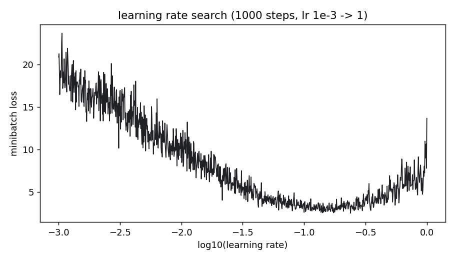
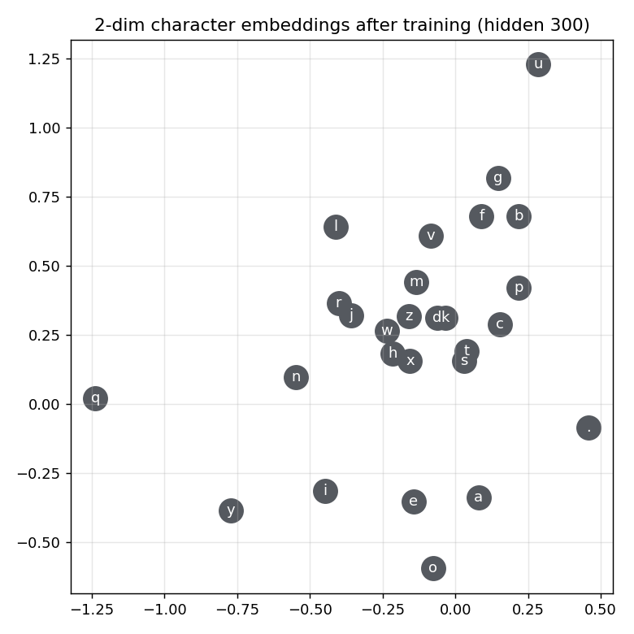
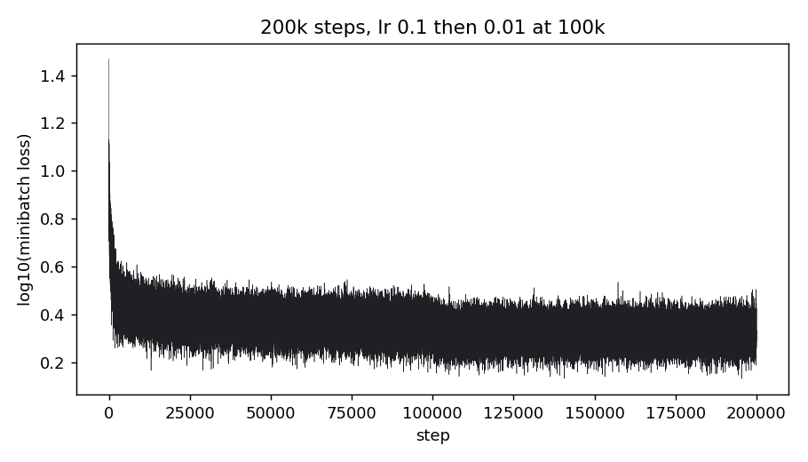

# makemore 2: MLP, 임베딩, 학습의 기본기

- 강의: Andrej Karpathy, [Building makemore Part 2: MLP](https://www.youtube.com/watch?v=TCH_1BHY58I) (2022-09, 1h15m). Zero to Hero 시리즈 3편.
- 코드: 강의에서 타이핑한 노트북 [nn-zero-to-hero/lectures/makemore/makemore_part2_mlp.ipynb](https://github.com/karpathy/nn-zero-to-hero/blob/master/lectures/makemore/makemore_part2_mlp.ipynb) (커밋 `73c3fcc`, 36셀). 저장소 [karpathy/makemore](https://github.com/karpathy/makemore) (MIT, 커밋 `988aa59`)의 `MLP` 클래스는 [@sec-diff]에서 대조한다. 논문: Bengio, Ducharme, Vincent, Jauvin, [A Neural Probabilistic Language Model](https://www.jmlr.org/papers/volume3/bengio03a/bengio03a.pdf), JMLR 2003.
- 정리 방식: 노트북의 계산을 별도 스크립트로 재구성해 이 서버에서 실행하고(Python 3.9, torch 2.8.0 CPU) 출력을 기록했다. 본문 수치는 그 결과이고 강의·노트북 값과 다른 곳은 그렇게 적었다. 학습에는 무작위 미니배치가 들어가므로 loss는 소수 둘째 자리쯤에서 실행마다 다르다. 강의 설명은 자동 생성 영어 자막(2,147줄)을 바탕으로 했고 화면(논문 페이지, 그래프)은 보지 못했다. 그래프는 같은 코드로 다시 그렸다.
- 검수: 초안을 Claude 서브에이전트와 Codex CLI가 독립적으로 자막·노트북·논문·저장소 코드와 대조해 리뷰했고, 지적을 근거로 판정해 반영했다.
- 코드 블록에서 `# 각주:`로 시작하는 주석과 셀 출력을 옮겨 적은 주석은 정리자가 단 것이고, 나머지 주석은 원본이다. 셀을 합치거나 줄인 블록이 있다. `cell N`은 0부터 세는 셀 인덱스다.

## 공식 자료 (영상 설명란)

- [강의 노트북](https://github.com/karpathy/nn-zero-to-hero/blob/master/lectures/makemore/makemore_part2_mlp.ipynb) · [Colab 노트북](https://colab.research.google.com/drive/1YIfmkftLrz6MPTOO9Vwqrop2Q5llHIGK?usp=sharing) (영상 끝에 소개. 설치 없이 브라우저에서 같은 코드를 돌릴 수 있다) · [Bengio et al. 2003 PDF](https://www.jmlr.org/papers/volume3/bengio03a/bengio03a.pdf)
- 참고: [ezyang, PyTorch internals (2019)](http://blog.ezyang.com/2019/05/pytorch-internals/) — `view`가 어떻게 storage 위의 논리적 구조인지.
- 연습문제 E01–E03이 설명란에 있다([@sec-exercises]).
- 공식 챕터 19개가 설명란에 있다. 아래 절의 시간은 그 챕터를 따른다.

## 한 줄 요약

앞 글자를 하나만 보는 bigram 표는 문맥을 늘리면 행 수가 27^n으로 터진다. Bengio 2003의 답은 글자(단어)를 **작은 실수 벡터(임베딩)로 바꾸고**, 그 벡터들을 이어 붙여 은닉층 하나짜리 신경망에 넣는 것이다. 표는 27^3개의 행을 따로 배워야 하지만, 임베딩은 비슷한 글자를 가까운 벡터에 두어 본 적 없는 문맥으로도 **일반화**한다. 이 강의는 그 모델을 만들면서 학습의 기본기, 즉 미니배치, 학습률 찾기, train/dev/test 분할, 과소·과적합 판단, 학습률 감쇠를 한 번씩 손으로 해 본다. 결과는 지난 강의 bigram의 2.45(전체 데이터 기준)에서 dev loss **2.17**로 내려간다. 두 값은 평가한 데이터가 달라 엄밀한 같은 조건 비교는 아니다.

## 강의 구조와 코드 대응

| 시간 | 주제 | 노트북 | minimind 대응 |
|---|---|---|---|
| 0:00–0:09 | bigram의 한계, Bengio 2003 논문 훑기 | — | `embed_tokens` |
| 0:09–0:12 | block_size 3짜리 데이터셋 만들기 | cell 4–5 | `PretrainDataset` |
| 0:12–0:18 | 임베딩 lookup `C[X]`, one-hot과의 동치, 텐서 인덱싱 | cell 7–8 | `nn.Embedding` |
| 0:18–0:29 | 은닉층, `cat`/`unbind`/`view`, storage와 stride | cell 9–12 | `view`/`reshape` 곳곳 |
| 0:29–0:32 | 출력층, softmax, NLL | cell 13–19 | `lm_head` |
| 0:32–0:38 | 정리, `F.cross_entropy`를 쓰는 세 가지 이유 | cell 20–24 | `F.cross_entropy` |
| 0:38–0:45 | 학습 루프, 32개 과적합, 미니배치 | cell 27 | `train_pretrain.py` 루프 |
| 0:45–0:53 | 학습률 탐색(지수 간격), 학습률 감쇠 | cell 25–28 | `get_lr` |
| 0:53–1:00 | train/dev/test 분할과 이유 | cell 6 | — |
| 1:00–1:13 | 은닉 300, 임베딩 시각화, 임베딩 10, 최종 2.17 | cell 22–31 | `hidden_size` |
| 1:13–1:15 | 샘플링, Colab 안내 | cell 33–34 | `generate()` |

cell 27은 강의 내내 고쳐 쓴 학습 셀의 최종본(200,000스텝)이라 여러 절에 걸친다.

---

## 왜 표로는 안 되나 (0:00–0:09) {#sec-why}

bigram 표는 앞 글자 하나(27가지 문맥)당 한 행이다. 앞 글자를 둘로 늘리면 27×27 = 729행, 셋이면 약 20,000행(27^3 = 19,683)이다. 행은 지수적으로 늘고 행마다 카운트는 줄어서 통계가 성기고 모델은 "터진다". 그래서 이번에는 Bengio et al. 2003의 MLP 언어 모델을 따른다. 이 논문이 신경망 언어 모델의 최초는 아니지만 그 아이디어를 대표하는 논문으로 자주 인용되고, 카파시 말로 "19쪽이지만 읽기 좋다".

논문은 단어 단위(어휘 17,000개, 실제 논문의 AP News 실험은 |V| = 17,964)이고 강의는 글자 단위(27개)라는 것만 다르고 접근은 같다. 핵심 아이디어는 다음과 같다.

- 각 단어에 **30차원 실수 벡터**(feature vector)를 붙인다. 17,000개 점이 30차원 공간에 들어가니 처음에는 무작위로 흩어져 있지만, 역전파로 이 벡터들도 함께 학습한다. 학습이 끝나면 뜻이 비슷하거나 같은 자리에 쓰이는 단어들이 가까이 모일 수 있다(카파시의 표현도 "might end up"이다).
- 그 위의 모델은 우리와 똑같다. 앞 단어들의 벡터를 받아 다음 단어를 예측하는 다층 신경망이고, 훈련 데이터의 log likelihood를 최대화한다.
- **왜 일반화되나.** "A dog was running in a ___"를 훈련에서 본 적이 없어도(out of distribution), "The dog was running in a ___"를 봤고 a와 the의 임베딩이 가까우면 지식이 전이된다. cats와 dogs, walking과 running도 마찬가지다. 표 모델에는 이런 "비슷함"을 표현할 자리가 없다.

논문 Figure 1의 구조(이 강의 크기로 옮긴 것이 [@fig-mlp]). 앞 단어 3개의 인덱스 → 공유 lookup 표 C(17,000×30)에서 행을 꺼내 30차원 벡터 3개, 합쳐 90개 입력 → 은닉층(크기는 hyperparameter, 예: 100, tanh) → 출력층 17,000개 logits → softmax. 파라미터는 출력층과 은닉층의 가중치·편향과 표 C 전부이고 모두 역전파로 배운다. 연산 대부분은 17,000개짜리 출력층에서 일어난다. 논문 식 (1)의 `y = b + Wx + U·tanh(d + Hx)`에서 `Wx`는 입력에서 출력으로 가는 선택적 직접 연결(그림의 점선)인데, 강의는 이것을 쓰지 않는다.

**hyperparameter**라는 말이 여기서 처음 나온다. 은닉층 크기, 임베딩 차원처럼 학습으로 정해지지 않고 설계자가 고르는 값이다.

::: {.callout-note title="minimind 대응"}
논문의 표 C가 `nn.Embedding`이고 minimind의 `embed_tokens = nn.Embedding(6400, hidden_size)`(`model/model_minimind.py:201`)가 그것이다. 토큰 6400개를 `hidden_size`(기본 768) 차원에 넣는다. 이 강의는 27개를 2차원, 나중에 10차원에 넣는다.
:::

{#fig-mlp}

## 데이터셋 (0:09–0:12) {#sec-dataset}

```python
words = open('names.txt', 'r').read().splitlines()          # 각주: cell 1–3. 지난 강의와 같은 준비
chars = sorted(list(set(''.join(words))))
stoi = {s:i+1 for i,s in enumerate(chars)}                   # 각주: a→1 … z→26
stoi['.'] = 0                                                 # 각주: '.'이 0. 문맥 패딩에도 이 0을 쓴다
itos = {i:s for s,i in stoi.items()}

block_size = 3 # context length: how many characters do we take to predict the next one?
X, Y = [], []
for w in words[:5]:                     # 각주: 개발 중에는 5단어만. 나중에 전체로
  context = [0] * block_size            # 각주: 시작은 '...' — 0(=.)으로 채운 문맥
  for ch in w + '.':                    # 각주: 끝 토큰 '.'까지 예측 대상
    ix = stoi[ch]
    X.append(context)                   # 각주: 입력 = 현재 문맥 3글자
    Y.append(ix)                        # 각주: 정답 = 다음 글자
    context = context[1:] + [ix]        # crop and append   각주: 창을 한 칸 밀기 (rolling window)
X = torch.tensor(X)
Y = torch.tensor(Y)
```

이름은 지난 강의와 같은 32,033개다. "emma"에서 나오는 예제는 `... → e`, `..e → m`, `.em → m`, `emm → a`, `mma → .`의 다섯 개다. 처음 5단어에서 32개 예제가 나오고 `X`는 (32, 3) 정수, `Y`는 (32,) 정수다. `block_size`를 4, 5, 10으로 바꾸면 그만큼 긴 문맥으로 다음 글자를 예측하고, 항상 `.`으로 앞을 채운다. 강의는 논문과 맞추려 3으로 돌아온다.

::: {.callout-note title="minimind 대응"}
minimind는 문맥 창을 이렇게 잘라 만들지 않는다. `PretrainDataset.__getitem__`(`dataset/lm_dataset.py:47–55`)은 문서 하나를 BOS + 토큰들 + EOS로 만들어 `max_length`까지 pad하고, `labels`를 `input_ids`의 복사본으로 두되 pad 자리는 −100으로 지운다. "한 칸 어긋난 짝짓기"는 모델의 forward에서 한다(`model_minimind.py:251`). 시퀀스 하나에서 모든 위치의 예측을 한 번에 계산하기 때문이다. 이것은 이 노트북과 minimind의 데이터 구성 방식 차이이지 MLP와 Transformer의 본질적 차이는 아니다. 저장소의 `MLP`도 시퀀스 전체 위치를 한 번에 처리한다([@sec-diff]).
:::

## 임베딩 lookup (0:12–0:18) {#sec-embedding}

```python
C = torch.randn((27, 2))    # 각주: 글자 27개를 2차원에. 논문의 17,000×30을 흉내 낸 최소 크기
```

정수 5를 임베딩하는 방법은 둘이고 결과는 같다. `C[5]`로 5번 행을 꺼내거나, 지난 강의처럼 `F.one_hot(torch.tensor(5), num_classes=27).float() @ C`로 곱하거나. one-hot 곱은 C의 다른 행을 전부 0으로 지우고 5번 행만 남기니 같은 값이다. 그래서 임베딩은 "표에서 행을 꺼내는 것"으로도, "비선형이 없는 첫 번째 선형층(가중치 C)에 one-hot을 넣는 것"으로도 볼 수 있다. 둘이 같으니 훨씬 빠른 인덱싱을 쓰고 one-hot 해석은 버린다.

카파시는 여기서 일부러 오류 두 개를 낸다. `F.one_hot(5, ...)`는 정수가 아니라 텐서를 받아야 해서 `TypeError`, one-hot 결과는 `int64`(long)라 `float`인 C와 곱할 수 없어 `RuntimeError`가 난다(이 서버 메시지: "expected m1 and m2 to have the same dtype, but got: long int != float"). `.float()`로 고친다.

(32, 3)개 정수를 한 번에 임베딩하려면 PyTorch 인덱싱의 유연함을 쓴다.

```python
C[[5, 6, 7]].shape        # torch.Size([3, 2])   각주: 리스트로 인덱싱
C[torch.tensor([5,6,7,7,7])].shape   # 각주: 정수 텐서로도. 같은 행을 여러 번 꺼낼 수도
emb = C[X]                # 각주: (32,3) 정수 텐서로 인덱싱 → (32, 3, 2). 정수 하나하나가 2차원 벡터로
emb.shape                 # torch.Size([32, 3, 2])
C[X][13, 2] == C[X[13, 2]]   # 각주: 13번 예제의 세 번째 자리 (값 1 = 'a')의 임베딩 = C[1]. 전부 True
```

::: {.callout-note title="minimind 대응"}
`nn.Embedding`은 정확히 `C[X]`다. `embed_tokens(input_ids)`(`model_minimind.py:214`)는 (batch, seq) 정수를 (batch, seq, hidden) 실수로 바꾼다. 내부 가중치 `weight`가 이 강의의 C이고, 기본으로 `lm_head`와 공유된다(`:242`).
:::

## 은닉층과 텐서 내부 (0:18–0:29) {#sec-hidden}

```python
W1 = torch.randn((6, 100))    # 각주: 입력 6 = 글자 3개 × 2차원, 뉴런 100개 (hyperparameter)
b1 = torch.randn(100)
emb @ W1 + b1                 # 각주: 안 된다. (32,3,2) @ (6,100)은 shape이 안 맞음
```

임베딩 3개가 (32, 3, 2)에 쌓여 있어 (6, 100)과 곱할 수 없다. (32, 6)으로 **이어 붙여야** 한다. 카파시는 torch에 같은 일을 하는 방법이 여럿이고 그중 더 빠르고 짧은 것이 있다는 점을 보이려고 세 가지를 차례로 쓴다. torch 문서의 함수 목록 스크롤바가 아주 작을 만큼 함수가 많다는 것도 보여 준다.

1. `torch.cat([emb[:, 0, :], emb[:, 1, :], emb[:, 2, :]], 1)` → (32, 6). 자리마다 (32, 2)를 꺼내 1번 차원으로 이어 붙인다. block_size가 바뀌면 코드를 고쳐야 해서 "못생겼다".
2. `torch.cat(torch.unbind(emb, 1), 1)`. `unbind`가 1번 차원을 떼어 내 (32, 2) 텐서 3개의 튜플을 주므로 block_size에 무관하다.
3. `emb.view(32, 6)` 또는 `emb.view(-1, 6)`. 값이 1, 2와 같고(`==`로 확인) 훨씬 효율적이다. 단, `view`는 이 예제처럼 메모리가 연속인(contiguous) 텐서에서 원소 수만 같으면 되고, 전치 등으로 stride가 꼬인 텐서에서는 새 shape이 기존 stride와 호환되어야 하며 아니면 에러가 난다(이 서버: `arange(18).reshape(3,6).t().view(18)`은 RuntimeError). 그럴 때는 `reshape`이 필요하면 복사한다(정리자 보충).

### storage와 view

3이 효율적인 이유가 이 구간의 핵심이다. `torch.arange(18)`은 `.view(2, 9)`, `.view(9, 2)`, `.view(3, 3, 2)`로 원소 수만 같으면 어떤 모양으로도 다시 볼 수 있다. 텐서에는 **storage**라는, 메모리에 1차원으로 놓인 숫자열이 있고, `view`는 그 storage를 어떻게 n차원으로 해석할지 정하는 속성(storage offset, shape, stride)만 바꾼다. 메모리를 복사하거나 새로 잡지 않으니 아주 싸다. 반면 `cat`은 새 storage를 만들어야 하므로 비싸다. 이 서버에서 `a.view(3,3,2).data_ptr() == a.data_ptr()`는 True, `cat` 결과의 `data_ptr`은 다르다. `emb`의 한 행은 storage에서 이미 `[x0 y0 x1 y1 x2 y2]` 순서로 놓여 있어서 `view(-1, 6)`만으로 이어 붙인 것과 같아진다. 자세한 것은 ezyang의 PyTorch internals 글을 권하며, 카파시는 텐서 내부만 다루는 영상을 만들지도 모른다고 한다(이 노트 작성 시점의 시리즈 목록에는 그런 편이 없다. 정리자 확인: nn-zero-to-hero README, 커밋 `73c3fcc`).

{#fig-view}

```python
h = torch.tanh(emb.view(-1, 6) @ W1 + b1)   # 각주: -1은 "나머지에서 추론". emb.shape[0]을 써도 됨
h.shape                                     # torch.Size([32, 100])   각주: 값은 tanh 때문에 -1과 1 사이. float32에서는 포화로 정확히 ±1도 나온다
```

`+ b1`은 broadcasting을 다시 한번 확인한다. (32, 100) + (100,)은 오른쪽 정렬로 (1, 100)이 되어 세로로 복사되고, 같은 편향이 모든 행에 더해진다. 이번에는 그것이 원하는 동작이다. "발등을 찍지 않으려면 늘 확인하라."

::: {.callout-note title="minimind 대응"}
`view`와 `reshape`은 minimind 곳곳에 있다. 예를 들어 `F.cross_entropy(x.view(-1, x.size(-1)), y.view(-1))`(`model_minimind.py:252`)는 한 칸 어긋나게 자른 (batch, seq−1, vocab) logits를 (batch·(seq−1), vocab)으로, labels를 (batch·(seq−1),)로 펴서 모든 위치를 한 번에 분류 문제로 만든다(pad 자리 −100은 제외). 여기의 `-1`이 이 절의 `-1`이다.
:::

## 출력층과 loss (0:29–0:38) {#sec-output}

```python
W2 = torch.randn((100, 27))
b2 = torch.randn(27)
logits = h @ W2 + b2                          # (32, 27)
counts = logits.exp()
prob = counts / counts.sum(1, keepdims=True)  # 각주: softmax. 행마다 합 1
loss = -prob[torch.arange(32), Y].log().mean()   # 각주: 정답 열만 뽑아 −log 평균. 지난 강의와 같음
```

강의 화면에서 정답에 준 확률은 일부가 0.2쯤이지만 대부분 아주 작다. 이 서버의 seed 초기화에서는 작게는 6e-15까지 내려간다. 아직 학습 전이니 당연하고, 이 서버의 초기 loss는 **17.77**(강의 "17")이다.

### `F.cross_entropy`를 쓰는 세 가지 이유 (0:32–0:38)

노트북 cell 22–24처럼 정리한다. 파라미터를 리스트 하나에 모으면 세기 편하다. 임베딩 2, 은닉 100일 때 **3,481개**(강의 "약 3,400").

```python
g = torch.Generator().manual_seed(2147483647) # for reproducibility
C = torch.randn((27, 2), generator=g)
W1 = torch.randn((6, 100), generator=g)
b1 = torch.randn(100, generator=g)
W2 = torch.randn((100, 27), generator=g)
b2 = torch.randn(27, generator=g)
parameters = [C, W1, b1, W2, b2]              # 각주: 노트북 최종본은 (27,10), (30,200)으로 11,897개
sum(p.nelement() for p in parameters)         # 3481
emb = C[X]; h = torch.tanh(emb.view(-1, 6) @ W1 + b1); logits = h @ W2 + b2   # 각주: 새 파라미터로 forward를 다시
loss = F.cross_entropy(logits, Y)             # 각주: 위의 exp → 나누기 → 인덱싱 → log → 평균 세 줄과 같은 값
```

직접 짠 softmax + NLL은 교육용이고 실전에서는 `F.cross_entropy`를 쓴다. 이유 세 가지.

1. **forward가 효율적일 수 있다.** 직접 짜면 `counts`, `prob` 같은 중간 텐서가 메모리에 생긴다. PyTorch는 이 연산들을 묶어 흔히 fused kernel로 계산한다(실제 구현은 실행 환경에 따라 다르다).
2. **backward가 단순하다.** micrograd에서 tanh를 봤듯, 묶인 식은 미분이 수학적으로 단순해진다(tanh는 `1 − t²`). exp, 나누기, log를 하나씩 역전파하는 대신 정리된 식으로 끝낼 수 있다.
3. **수치적으로 안전하다.** logits가 `[-2, 3, -3, 0, 5]`면 괜찮지만 큰 양수, 예를 들어 100이 섞이면 `exp(100)`이 float32 범위를 넘어 `inf`가 되고 확률은 `nan`이 된다(이 서버에서 재현). 이 예제에서 한 logit이 −100이 되는 것은 exp가 0에 가까워질 뿐이라 괜찮다(모든 logit이 크게 음수면 underflow로 역시 `nan`이 되는데, 강의는 다루지 않는다. 정리자 보충). softmax는 logits에 어떤 상수를 더하거나 빼도 결과가 같으므로(지난 강의 노트의 "두 가지 메모" 절에서 정리자가 지적한 성질), PyTorch는 내부에서 **최댓값을 빼서** 가장 큰 logit을 0으로 만든 뒤 exp를 한다. 그러면 모든 값이 0 이하라 절대 넘치지 않는다.

::: {.callout-note title="minimind 대응"}
`F.cross_entropy(..., ignore_index=-100)`(`model_minimind.py:252`)가 이 셋을 다 받는다. minimind는 GPU에서 forward를 bfloat16 autocast 안에서 돌리는데(`train_pretrain.py:35, 122–123`), autocast는 softmax와 cross_entropy 같은 연산을 float32로 올려 계산하고 bfloat16의 표현 범위도 float32와 거의 같아서 exp가 더 쉽게 넘치지는 않는다. 어휘 6400개짜리 logits에 안정적인 cross entropy를 쓰는 것이 중요하다는 점은 같다.
:::

## 학습 루프, 과적합, 미니배치 (0:38–0:45) {#sec-train}

```python
for p in parameters:
  p.requires_grad = True                # 각주: 이걸 빼먹으면 backward에서 에러. 카파시도 처음 코드에서 빠뜨렸다가 실행 전에 추가한다

for _ in range(1000):
  # forward pass
  emb = C[X]                            # (32, 3, 2)
  h = torch.tanh(emb.view(-1, 6) @ W1 + b1)   # (32, 100)
  logits = h @ W2 + b2                  # (32, 27)
  loss = F.cross_entropy(logits, Y)
  # backward pass
  for p in parameters:
    p.grad = None                       # 각주: 0으로 채우는 대신 None. 지난 강의와 같음
  loss.backward()
  # update
  for p in parameters:
    p.data += -0.1 * p.grad             # 각주: 파라미터가 5개라 루프. micrograd의 갱신과 같은 꼴
```

5단어 32개 예제로 돌리면 loss가 17.77 → (10번째 스텝) 4.41 → (100번째) 0.34 → (1000번째) 0.26으로 떨어진다. 이렇게 쉬운 이유는 파라미터 3,481개로 예제 32개를 외우고 있기 때문이다. 이것을 **한 배치를 과적합한다(overfitting a single batch)**고 한다. 새 코드를 짜면 먼저 이렇게 작은 데이터로 loss가 0 근처까지 가는지 확인하는 것이 관례다(정리자 보충. 강의는 현상만 보여 준다).

그래도 정확히 0은 안 된다. `logits.max(1)`은 최댓값과 그 인덱스를 함께 주는데, 예측 인덱스가 정답과 대부분 같지만 첫 예제는 정답 e(5) 대신 다른 글자를 낸다. 입력 `...`이 e(emma), o(olivia), a(ava), i(isabella), s(sophia)를 모두 정답으로 갖기 때문이다. 같은 입력에 다른 정답이 있으면 어떤 파라미터로도 loss를 0으로 만들 수 없다. 입력이 유일한 예제들은 정확히 맞힌다.

### 전체 데이터와 미니배치 (0:41–0:45)

5단어 제한을 풀면 예제가 **228,146개**가 된다. 코드는 그대로 돈다. 그런데 한 스텝이 눈에 띄게 느리다. 22만 개를 매번 forward·backward하는 것은 일이 너무 많다. 실전에서는 데이터의 일부를 무작위로 골라(**미니배치**) 그것만으로 forward, backward, 갱신을 한다.

```python
ix = torch.randint(0, X.shape[0], (32,))   # 각주: 0 이상 X.shape[0] 미만 정수 32개. size는 튜플이어야 함
emb = C[X[ix]]                              # 각주: 32행만. (32, 3, 2)
...
loss = F.cross_entropy(logits, Y[ix])       # 각주: 정답도 같은 ix로
```

이 서버에서 전체 배치 forward+backward 한 번은 0.51초, 미니배치 32개의 학습 스텝(추출·forward·backward·갱신 포함) 100회는 합쳐 0.05초다. 측정 범위가 조금 다르지만 스텝당 약 1,000배 차이다. 미니배치의 기울기는 전체 기울기의 근사라 방향이 덜 정확하지만, 32개로 추정한 방향도 쓸 만하다. **근사 기울기로 많이 걷는 것이 정확한 기울기로 조금 걷는 것보다 낫다.** 이것이 미니배치가 실전 표준인 이유다. 미니배치 loss는 2.5 근처를 오가지만 그 배치만의 값이므로, 전체 훈련 데이터로 다시 재면 2.7쯤이고 더 돌리면 2.6, 2.57, 2.53으로 내려간다.

::: {.callout-note title="minimind 대응"}
`train_pretrain.py`는 `batch_size` 기본 32(`:88`)의 미니배치를 `DataLoader`로 돌리고 8배치를 누적해 갱신한다. 이 강의는 `randint`로 복원 추출하지만 minimind는 epoch마다 데이터를 한 번씩 훑는다. 갱신은 `AdamW`, 학습률은 아래 절의 스케줄이다.
:::

## 학습률 찾기와 감쇠 (0:45–0:53) {#sec-lr}

0.1은 찍은 값이다. 너무 느린지 빠른지 모른다. 카파시가 보여 주는 방법은 다음과 같다.

1. 파라미터를 초기화하고 100스텝쯤 돌리며 loss를 본다. 아주 작은 값이면 거의 안 줄고, 0.001은 느리지만 줄어서 "괜찮은 아래쪽 끝"으로 삼는다. 1은 줄긴 하지만 위아래로 튀어 불안정하고, 10은 아예 최적화가 안 된다. 그러니 답은 0.001과 1 사이다. (첫 번째 "아주 작은 값"이 얼마였는지는 화면을 못 봐 모른다. 이 서버 100스텝 뒤 미니배치 loss: 0.001 → 16.9, 0.1 → 3.0, 1 → 6.2, 10 → 41.)
2. 그 사이를 **지수 간격**으로 훑는다. 카파시는 선형으로 나누는 것은 "말이 안 된다"고만 하는데, 선형이면 후보 대부분이 0.1 이상에 몰리기 때문이다(정리자 보충). 지수를 −3에서 0까지 선형으로 만들고 10의 거듭제곱을 취한다.

```python
lre = torch.linspace(-3, 0, 1000)   # 각주: 지수를 선형으로 1000개
lrs = 10**lre                       # 각주: 0.001 … 1, 지수 간격
lri, lossi = [], []
for i in range(1000):
  ...                               # 각주: forward, backward는 위와 같음
  lr = lrs[i]                       # 각주: 스텝마다 학습률을 키워 가며
  for p in parameters:
    p.data += -lr * p.grad
  lri.append(lre[i])                # 각주: x축은 학습률이 아니라 지수
  lossi.append(loss.item())
plt.plot(lri, lossi)
```

그래프는 대개 왼쪽(작은 학습률)에서는 거의 변화가 없고, 가운데 골짜기가 있고, 오른쪽 끝에서 불안정해진다. 골짜기, 즉 지수 −1 부근이 좋은 학습률이고 10^−1 = 0.1이니 처음 찍은 값이 실제로 괜찮았다. 이 서버의 재현([@fig-lr])도 −1.0에서 −0.5 사이가 가장 낮고(구간 평균 3.2) 0에 가까워지면 다시 올라간다.

{#fig-lr}

이제 0.1로 10,000스텝씩 돌린다. 강의는 2.48 → 2.46으로 내려와 bigram의 2.45를 곧 넘고, 정체가 보이면 **학습률 감쇠(learning rate decay)**, 즉 학습률을 10분의 1(0.01)로 낮춰 조금 더 돌려 2.3에 이른다(이 값들은 분할 전이라 전체 228,146개로 잰 것이다). 이 서버(임베딩 2, 은닉 100, train 분할로 측정): 0.1로 10,000스텝 뒤 2.47, 20,000스텝 뒤 2.45, 0.01로 10,000스텝 더 돌리면 **2.36**. 카파시 스스로 "엉성하고 실전 방식은 아니다"라고 하지만 골격은 같다. 적당한 학습률을 찾고, 그것으로 한참 학습하고, 끝에 학습률을 낮춰 몇 스텝 더 간다.

::: {.callout-note title="minimind 대응"}
minimind의 감쇠는 스텝마다 부드럽게 한다. `get_lr`(`trainer/trainer_utils.py:42–43`)은 `lr × (0.1 + 0.45 × (1 + cos(π·step/total)))`, 즉 cosine 스케줄로 시작 값에서 10%까지 내려간다. `train_pretrain.py:31`이 매 스텝 이것을 optimizer에 넣는다. 강의의 "10배 낮추기"를 연속으로 만든 것이다. 시작 학습률 5e-4(`:89`)는 AdamW용이라 이 강의의 0.1과 직접 비교할 수 없다.
:::

## train / dev / test (0:53–1:00) {#sec-splits}

"loss 2.3이니 bigram(2.45)보다 좋다"에는 함정이 있다. 모델을 키우면(파라미터 만 개, 십만 개, 백만 개) 훈련 데이터를 **통째로 외워** 훈련 loss가 0에 가까워질 수 있다. 그런 모델은 샘플링하면 훈련 데이터를 그대로 뱉고, 처음 보는 이름에서는 loss가 매우 높다. 좋은 모델이 아니다. (이것은 일반론이다. 문맥을 3글자로 고정한 지금 모델은 [@sec-train]의 이유로 훈련 loss에 하한이 있다. 전체 데이터의 문맥별 정답 빈도로 계산하면 약 1.88이고, 은닉층을 아무리 키워도 그 아래로 못 간다. 정리자 계산.) 그래서 데이터를 세 조각으로 나눈다.

| 분할 | 비율 | 용도 |
|---|---|---|
| train | 80% | 파라미터 학습 (경사하강) |
| dev / validation | 10% | hyperparameter 결정 (은닉 크기, 임베딩 차원, regularization 세기 등) |
| test | 10% | 마지막에 성능 보고. **아주 드물게만** 본다 |

비율은 예제가 아니라 **이름** 기준이다. 이름을 먼저 섞어 나눈 뒤 각 분할에서 문맥–정답 예제를 만들므로 예제 수의 비율은 정확히 80/10/10이 아니다.

test를 볼 때마다 무언가를 배워 모델에 반영하면 test에도 학습하는 셈이다. 그래서 논문에 적을 숫자를 뽑을 때 한 번만 쓴다.

```python
def build_dataset(words):        # 각주: 위의 데이터셋 코드를 함수로
  ...
  return X, Y

import random
random.seed(42)
random.shuffle(words)            # 각주: 제자리에서 섞고 나서 자른다 (이유는 강의가 말하지 않지만 파일 순서의 편향을 피하려는 것. 정리자 보충)
n1 = int(0.8*len(words))         # 25626
n2 = int(0.9*len(words))         # 28829
Xtr, Ytr = build_dataset(words[:n1])      # 각주: 이 서버 (182625, 3). 노트북은 182441
Xdev, Ydev = build_dataset(words[n1:n2])  # 각주: (22655, 3). 노트북 22902
Xte, Yte = build_dataset(words[n2:])      # 각주: (22866, 3). 노트북 22803
```

분할 크기가 노트북과 조금 다르다. 이유는 노트북 cell 6이 `words`를 제자리에서 섞기 때문이다. 그 셀을 네 번 실행한 상태(seed 42로 네 번 누적 shuffle)에서는 이 서버에서도 정확히 182,441 / 22,902 / 22,803이 나온다(리뷰에서 밝혀낸 것). 어느 쪽이든 dev와 test는 이름 3,203개와 3,204개(강의의 "3,000, 3,204")이고 예제 수는 그 이름들에서 나온 것이다. 이후 학습은 `Xtr, Ytr`만 쓰고 평가는 `Xdev, Ydev`로 한다.

강의는 여기서 잠깐 학습률을 0.01로 두고 돌려 너무 느린 것을 보고 0.1로 되돌리는 실수를 한다. 10,000스텝 뒤 dev loss는 약 2.3. 신경망이 본 적 없는 예제인데도 훈련 loss와 거의 같다. **훈련 loss ≈ dev loss면 과적합은 아니다.** 카파시는 이것을 과소적합(underfitting)이라 부르고, 그럴 때는 "대개" 모델이 너무 작다는 뜻이니 키우면 좋아질 것을 기대한다. 두 loss가 비슷하다는 것만으로 용량 부족과 최적화 부족을 가릴 수는 없으므로, 실제로 키워 보고 확인하는 것이 다음 절이다. (이 서버: 2/100 모델 train 2.47 / dev 2.47.)

## 모델 키우기와 임베딩 시각화 (1:00–1:13) {#sec-scale}

### 은닉 300 (1:00–1:05)

은닉층을 100에서 300으로 키우면 파라미터가 10,281개(강의 "10,000")가 된다. 30,000스텝을 돌리고 스텝별 loss를 그리면 그래프가 **두껍다**. 미니배치마다 loss가 달라 잡음이 있기 때문이다. dev는 2.5로 아직 100짜리보다 못하다. 큰 모델은 수렴이 더 오래 걸릴 수 있고, 배치 32는 잡음이 커서 배치를 키우는 것도 방법이라고 한다. 학습률을 반으로 줄이며 더 돌리면 2.32, 더 돌리면(자막상 학습률을 한 번 더 낮췄는지는 불명) train 2.23 / dev 2.24. 이 서버는 0.1로 30,000 → 2.55, 0.05로 30,000 → 2.35, 0.01로 30,000 → **train 2.27 / dev 2.27**. 모델을 3배 키웠는데 생각만큼 좋아지지 않았다. 카파시의 가설은 **병목이 2차원 임베딩**이라는 것이다. 27개 글자를 2차원에 우겨 넣어 신경망이 그 공간을 제대로 쓰지 못한다.

### 2차원 임베딩 그려 보기 (1:05–1:07)

임베딩을 키우기 전에, 2차원일 때만 할 수 있는 시각화를 한다. `C[:, 0]`과 `C[:, 1]`을 x, y로 놓고 글자를 찍는다.

{#fig-emb}

강의 화면에서는 모음 a, e, i, o, u가 한데 모이고, q는 예외적인 글자로 멀리 떨어지며, `.`도 특수 문자답게 바깥에 있다. 신경망이 모음들을 "서로 바꿔 써도 되는" 비슷한 입력으로 취급한다는 뜻이다. 카파시 표현으로 "무작위는 아니고 약간의 구조가 있다". Bengio 논문이 말한 종류의 구조가 보인다는 정성적 관찰이고, 일반화 성능 자체는 dev loss로 확인한다. 이 서버의 결과([@fig-emb])는 a, e, i, o가 아래쪽에 모이고 q가 왼쪽 끝, `.`이 오른쪽 끝에 있어 대체로 같지만 u는 모음 무리에서 떨어져 있다(a–e 거리 0.22, a–u 1.58). 학습 결과는 실행마다 다르고 강의도 "약간의 구조"라고만 말한다.

### 임베딩 10 (1:07–1:12)

임베딩을 2에서 10으로, 은닉을 300에서 200으로 바꾸면 파라미터 **11,897개**(강의 "11,000"). 입력이 3×10 = 30이므로 `view(-1, 6)`의 6을 30으로 고쳐야 한다. 카파시는 이런 magic number를 하드코딩하는 것이 실전에서는 안 좋다고 짚는다. loss 기록 리스트(`lossi`, `stepi`)의 초기화를 학습 셀 밖(cell 26)으로 빼서 학습 셀을 여러 번 돌려도 기록이 지워지지 않게 하고, loss 대신 `loss.log10()`을 기록한다. loss 그래프는 하키 스틱 모양이 되기 쉬운데 log가 그것을 눌러 보기 좋게 한다.

0.1로 50,000스텝: train 2.3 / dev 2.38. 0.01로 50,000스텝 더: **train 2.17 / dev 2.2**. 이제 train과 dev가 조금 벌어지기 시작한다. 파라미터가 충분히 많아 천천히 과적합으로 가고 있다는 신호다. 한 번 더 돌리면 2.16 / 2.19. 최종 노트북 cell 27은 200,000스텝(앞 100,000은 0.1, 뒤 100,000은 0.01)이고 노트북 출력은 train 2.126 / dev 2.170이다. 이 서버 재현([@fig-loss]): 100,000스텝 뒤 2.31 / 2.34, 200,000스텝 뒤 **train 2.130 / dev 2.169**, test 2.169. 강의가 30분 만에 얻은 최고 dev loss는 **2.17**이고 이것이 E01의 목표다.

{#fig-loss}

카파시가 강조하는 것은 절차다. 학습은 오래 걸리니 보통 노트북에서 한 줄씩 하지 않고 job 여러 개를 띄워 며칠씩 기다린다고도 한다. 이 강의의 hyperparameter 조정은 "되는대로(haphazard)"였다. 실전에서는 이 설정들을 전부 인자로 빼고 실험을 여러 개 돌려 dev 성능이 가장 좋은 것을 고른 뒤, 그 모델로 test를 **한 번** 평가해 보고한다. 더 갈 길은 많다. 최적화 조정, 신경망 크기, 문맥 길이(3보다 많은 글자), 그리고 논문 안의 아이디어들.

::: {.callout-note title="minimind 대응"}
이 버전의 minimind `train_pretrain.py`에는 검증 분할과 평가 루프가 없고 훈련 loss만 로그로 찍는다. 이 학습 저장소(llm-study) README 로드맵의 "개선 과제: validation loss"가 이 강의의 dev loss를 붙이는 일이다. 모델 크기 hyperparameter는 `MiniMindConfig`의 `hidden_size`(기본 768), `num_hidden_layers`(8), `intermediate_size`(`model_minimind.py:12–26`)다.
:::

## 샘플링 (1:13–1:15) {#sec-sampling}

```python
g = torch.Generator().manual_seed(2147483647 + 10)
for _ in range(20):
    out = []
    context = [0] * block_size # initialize with all ...
    while True:
      emb = C[torch.tensor([context])] # (1,block_size,d)   각주: 예제 하나라 첫 차원이 1
      h = torch.tanh(emb.view(1, -1) @ W1 + b1)
      logits = h @ W2 + b2
      probs = F.softmax(logits, dim=1)                     # 각주: exp + 정규화. cross_entropy처럼 오버플로를 막아 준다
      ix = torch.multinomial(probs, num_samples=1, generator=g).item()
      context = context[1:] + [ix]                         # 각주: 창을 한 칸 밀어 새 글자를 넣음
      out.append(ix)
      if ix == 0:
        break
    print(''.join(itos[i] for i in out))
```

노트북 출력 20개는 `carmahela.`, `jhovi.`, `kimrin.`, `thil.`, `halanna.`, `jazhien.`, `amerynci.`, `aqui.`, `nellara.`, `chaiiv.`, `kaleigh.`, `ham.`, `joce.`, `quinton.`, `lilea.`, `jamilio.`, `jeron.`, `jaryni.`, `jace.`, `chrudeley.`다. 강의는 `ham`, `joce`, `lilea`(자막에는 joes, lela로 적혀 있으나 노트북 출력 기준)를 읽으며 "훨씬 이름답다"고 한다. 이 서버의 20개는 `carmah.`, `amorie.`, `khi.`, `mili.`, `taty.`, `skanden.`, `jazonen.`, `dellah.`, `jareen.`, `neemara.`, `chaiir.`, `kaleigh.`, `ham.`, `pole.`, `quint.`, `shodora.`, `jadii.`, `watthondiaryn.`, `kai.`, `eulius.`로, 학습된 파라미터와 데이터 분할이 달라 이름은 다르지만(`kaleigh`, `ham`은 같다) 질은 비슷하다. bigram의 `cexze.`, `momasurailezitynn.`과 비교하면 차이가 분명하다.

::: {.callout-note title="minimind 대응"}
`generate()`(`model_minimind.py:257–288`)의 루프와 같다. 다른 점은 문맥 창을 3으로 자르지 않고 지금까지의 토큰 전부를 문맥으로 쓴다는 것이다. 기본 `use_cache=True`면 앞 토큰들의 attention 중간값(KV cache)을 보관해 두고 매 스텝 새 토큰만 forward에 넣는다(`:264–265, 281`). 그리고 temperature와 top-k/p로 분포를 손본 뒤 `multinomial`한다는 것이다.
:::

## 저장소 `makemore.py`의 MLP와 강의의 차이 {#sec-diff}

```python
class MLP(nn.Module):
    """
    takes the previous block_size tokens, encodes them with a lookup table,
    concatenates the vectors and predicts the next token with an MLP.

    Reference:
    Bengio et al. 2003 https://www.jmlr.org/papers/volume3/bengio03a/bengio03a.pdf
    """

    def __init__(self, config):
        super().__init__()
        self.block_size = config.block_size
        self.vocab_size = config.vocab_size
        self.wte = nn.Embedding(config.vocab_size + 1, config.n_embd) # token embeddings table   각주: 강의의 C. +1은 아래 <BLANK>
        # +1 in the line above for a special <BLANK> token that gets inserted if encoding a token
        # before the beginning of the input sequence
        self.mlp = nn.Sequential(
            nn.Linear(self.block_size * config.n_embd, config.n_embd2),   # 각주: W1, b1. 입력 = 문맥 길이 × 임베딩 차원
            nn.Tanh(),
            nn.Linear(config.n_embd2, self.vocab_size)                    # 각주: W2, b2
        )

    def get_block_size(self):
        return self.block_size

    def forward(self, idx, targets=None):

        # gather the word embeddings of the previous 3 words
        embs = []
        for k in range(self.block_size):
            tok_emb = self.wte(idx) # token embeddings of shape (b, t, n_embd)
            idx = torch.roll(idx, 1, 1)                  # 각주: 시퀀스를 오른쪽으로 한 칸 밀어 "한 칸 전 토큰"을 만든다. 현재 → 1칸 전 → 2칸 전 순서
            idx[:, 0] = self.vocab_size # special <BLANK> token   각주: 밀려서 비는 첫 자리는 <BLANK>. 강의의 '.' 패딩 역할
            embs.append(tok_emb)

        # concat all of the embeddings together and pass through an MLP
        x = torch.cat(embs, -1) # (b, t, n_embd * block_size)   각주: 강의의 view(-1, 6)에 해당. 여기서는 cat
        logits = self.mlp(x)

        # if we are given some desired targets also calculate the loss
        loss = None
        if targets is not None:
            loss = F.cross_entropy(logits.view(-1, logits.size(-1)), targets.view(-1), ignore_index=-1)

        return logits, loss
```

| 항목 | 강의 노트북 | `makemore.py` `MLP` |
|---|---|---|
| 문맥 만들기 | 데이터셋 단계에서 3글자 창을 잘라 X (n, 3) | 시퀀스 (b, t) 전체를 넣고 `torch.roll`로 k칸 전 토큰을 만들어 모든 위치를 한 번에 |
| 앞 패딩 | `.`(0) | 시작 토큰 0은 그대로 두고, 시퀀스 시작 이전 자리만 별도 `<BLANK>`(`vocab_size` 번) |
| 문맥 순서 | 과거 → 최근 (`view`로 이어 붙임) | 현재 → 과거 (`roll` 순서대로 `cat`) |
| 임베딩 표 | `C = randn(27, d)` | `nn.Embedding(vocab_size+1, n_embd)` |
| 이어 붙이기 | `emb.view(-1, 6)` | `torch.cat(embs, -1)` |
| 은닉·출력 | `tanh(x @ W1 + b1) @ W2 + b2` | `nn.Sequential(Linear, Tanh, Linear)` |
| 기본 크기 | 임베딩 2→10, 은닉 100→300→200 | `n_embd` 64, `n_embd2` 64 |
| 분할 | 80/10/10 (train/dev/test) | train + test(10% 또는 최대 1,000단어), `create_datasets`. 이름은 test지만 500스텝마다 평가해 최적 checkpoint를 고르는 데 쓰므로 역할은 강의의 dev |
| 최적화 | 수동 SGD, 학습률 0.1 → 0.01 | `AdamW(lr=5e-4, weight_decay=0.01)` |

`torch.roll` 방식은 강의의 "미리 잘라 둔 창" 대신 시퀀스 전체 위치를 한 번에 처리한다. 같은 종류의 MLP 언어 모델이지만 입력 표현(패딩 토큰, 이어 붙이는 순서)이 달라 노트북의 가중치를 그대로 옮겨 넣을 수는 없다.

## 집중해서 볼 구간

1. **0:12–0:29 임베딩과 view.** `C[X]`가 `nn.Embedding`의 전부이고, `view`가 왜 공짜인지(storage) 아는 것이 이후 모든 텐서 코드의 기초다.
2. **0:32–0:38 `F.cross_entropy`의 세 이유.** 특히 최댓값을 빼는 수치 안정화는 attention의 softmax에서도 똑같이 쓰인다.
3. **0:45–1:00 학습률 탐색, 감쇠, 분할.** 이 강의에서 배우는 "학습의 기본기"의 핵심이고, minimind 실습에서 그대로 겪게 될 판단들이다.

## 이해 확인 질문

1. 문맥 3글자를 표로 세면 행이 몇 개인가. 임베딩 2, 은닉 100인 MLP의 파라미터는 몇 개인가. 두 방식은 "본 적 없는 문맥"을 어떻게 다르게 다루는가.
2. `C[X]`와 `F.one_hot(X, 27).float() @ C`가 같은 이유를 한 문장으로. 그런데 왜 후자를 버리는가.
3. `emb.view(-1, 6)`은 새 메모리를 잡지 않는데 `torch.cat(torch.unbind(emb, 1), 1)`은 잡는 이유는.
4. float32에서 logits에 100이 있으면 직접 짠 softmax는 왜 `nan`이 되고, `F.cross_entropy`는 어떻게 피하는가. softmax의 어떤 성질을 이용하나.
5. 32개 예제를 1000스텝 학습해도 loss가 0이 되지 않는 이유는.
6. 학습률 탐색에서 후보를 선형이 아니라 지수 간격으로 두는 이유는. 그래프에서 좋은 학습률은 어디에 있나.
7. train loss와 dev loss가 거의 같을 때 이 강의는 무엇을 의심하고 어떤 실험으로 확인했나. 둘이 벌어지기 시작하면 무엇을 뜻하나.
8. test를 자주 보면 안 되는 이유를 "test에 학습한다"는 말로 설명하라.

## 연습문제 (영상 설명란 E01–E03) {#sec-exercises}

- **E01** hyperparameter를 조정해 강의의 최고 validation loss 2.2(영상 본문 기준 2.17)를 이겨라. 손잡이: 은닉 크기, 임베딩 차원, 문맥 길이, 스텝 수, 학습률과 감쇠, 배치 크기.
- **E02** 이 영상은 초기화에 신경 쓰지 않았다. (1) 초기 예측이 완전히 균등하면 loss는 얼마인가. 실제 초기 loss는 얼마인가. (2) 초기 loss가 (1)에 가깝도록 초기화를 조정할 수 있는가. (이 서버: 균등이면 −log(1/27) = 3.30인데 seed 초기화의 10/200 모델은 훈련 데이터에서 26.0으로 시작한다. 초기 logits가 너무 크다는 뜻이고, 이 문제는 다음 강의(makemore 3)의 주제다.)
- **E03** 논문을 읽고 아이디어 하나를 구현해 보라. 효과가 있었는가.
