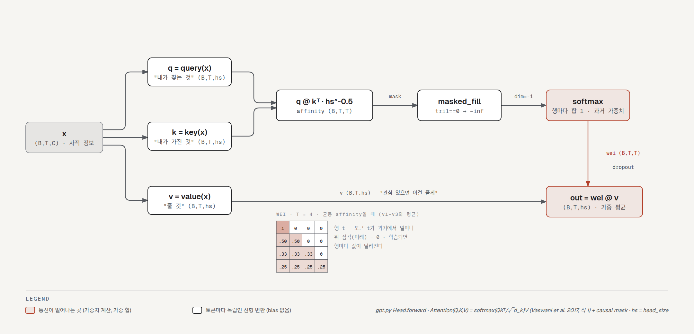
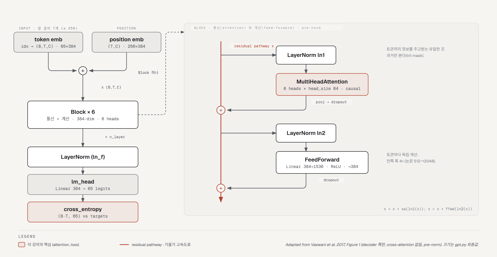

# Let's build GPT: Transformer를 처음부터

- 강의: Andrej Karpathy, [Let's build GPT: from scratch, in code, spelled out.](https://www.youtube.com/watch?v=kCc8FmEb1nY) (2023-01, 1h56m). Zero to Hero 시리즈 7편.
- 코드: [karpathy/ng-video-lecture](https://github.com/karpathy/ng-video-lecture) (MIT, 커밋 `5220142` 2023-02-07). `bigram.py`(122줄)는 강의 0:38 시점의 스크립트, `gpt.py`(225줄)는 최종본이고 `input.txt`가 tiny shakespeare, `more.txt`가 최종 모델의 생성문 10,000자다. 강의에서 실제로 타이핑한 Colab 노트북은 [영상 설명란](https://colab.research.google.com/drive/1JMLa53HDuA-i7ZBmqV7ZnA3c_fvtXnx-?usp=sharing)에 있고 저장소에는 없다. 저장소 `gpt.py`는 영상 뒤에 추가된 것이 하나 있다([@sec-diff]).
- 정리 방식: 강의의 단계별 모델(bigram → 단일 head → 다중 head → feed-forward → block → residual → LayerNorm)을 스크립트로 재구성해 이 서버(Python 3.9, torch 2.8.0 CPU)에서 학습하고(bigram 10,000스텝, 그 뒤 단계는 각각 5,000스텝) loss를 기록했다. 최종 모델(384-dim, 6층, block 256)은 카파시가 A100으로 15분 학습한 것이라 CPU에서는 돌리지 않았고, 대신 중간 크기(128-dim, 4층, block 64)를 3,000스텝 돌렸다. 강의 설명은 자동 생성 영어 자막(2,955줄)을 바탕으로 했고 화면(논문 그림, Colab 셀 출력)은 보지 못했다. 자막 오인식("Byram" = bigram, "Trill" = tril, "way/wei", "ATM W" = AdamW 등)은 문맥으로 교정했다.
- 검수: 초안을 Claude 서브에이전트와 Codex CLI가 독립적으로 자막·저장소 코드·논문과 대조해 리뷰했고, 지적을 근거로 판정해 반영했다.
- 코드 블록에서 `# 각주:`로 시작하는 주석과 출력 주석은 정리자가 단 것이고, 나머지 주석은 원본(`gpt.py`, `bigram.py`)이다. 강의 중간 단계의 코드는 자막 설명과 최종 `gpt.py`에서 되돌려 재구성했다.

## 공식 자료 (영상 설명란)

- [Colab 노트북](https://colab.research.google.com/drive/1JMLa53HDuA-i7ZBmqV7ZnA3c_fvtXnx-?usp=sharing) · [ng-video-lecture 저장소](https://github.com/karpathy/ng-video-lecture) · [nanoGPT](https://github.com/karpathy/nanoGPT)
- 논문: [Attention Is All You Need](https://arxiv.org/abs/1706.03762) (Vaswani et al. 2017) · [GPT-3](https://arxiv.org/abs/2005.14165) (Brown et al. 2020) · [ChatGPT 블로그](https://openai.com/blog/chatgpt/)
- 연습문제 EX1–EX4가 설명란에 있다([@sec-exercises]).
- 설명란의 정정 두 개: 0:57:00 "tokens from the past cannot communicate"는 "future"의 말실수. 1:20:05 정규화는 C가 아니라 head_size로 나눠야 한다(저장소 코드는 이미 `k.shape[-1]**-0.5`로 맞다).
- 공식 챕터 30개(그룹 제목 4개 별도)가 설명란에 있다. 아래 절의 시간은 그 챕터를 따른다.

## 한 줄 요약

GPT는 "앞 토큰들이 주어졌을 때 다음 토큰"을 예측하는 decoder-only Transformer이고, Transformer의 새로운 부분은 딱 하나, **self-attention**이다. 토큰마다 query("내가 찾는 것"), key("내가 가진 것"), value("줄 것")를 만들고, query와 key의 내적으로 과거 토큰에 대한 관심도(affinity)를 데이터에 따라 정한 뒤, softmax로 정규화해 value를 가중 평균한다. 미래는 하삼각 mask로 가린다. 그 위에 토큰별 MLP(feed-forward)를 얹고, 둘을 residual pathway 옆에 pre-norm으로 붙인 block을 6번 쌓으면 tiny shakespeare에서 val loss가 bigram의 2.5에서 **1.48**로 내려간다. 나머지 요소(위치 임베딩, multi-head, 4×MLP, residual, LayerNorm, dropout, 1/√d 스케일)는 각각 한 가지 문제를 푸는 장치이고, 이 강의는 그것을 하나씩 추가하며 val loss가 얼마나 내려가는지 보여 준다.

## 강의 구조와 코드 대응

| 시간 | 주제 | 코드 | minimind 대응 |
|---|---|---|---|
| 0:00–0:08 | ChatGPT, Transformer 논문, nanoGPT, tiny shakespeare | — | — |
| 0:08–0:14 | 데이터 읽기, 문자 tokenizer, train/val | `gpt.py:22–38` | `model/tokenizer.json` (BPE 6400) |
| 0:14–0:22 | block_size, batch, `get_batch` | `gpt.py:41–48` | `dataset/lm_dataset.py` |
| 0:22–0:42 | bigram 모델, loss, generate, 학습, 스크립트로 옮기기 | `bigram.py` | `MiniMindForCausalLM.forward`, `generate` |
| 0:42–1:00 | 수학 트릭: 하삼각 행렬 곱 = 과거 가중 평균 (v1–v3) | 노트북 | — |
| 1:00–1:02 | 위치 임베딩 | `gpt.py:143–144` | RoPE (`apply_rotary_pos_emb`) |
| 1:02–1:19 | **self-attention (v4)**, 여섯 가지 메모 | `Head` `gpt.py:64–90` | `Attention` `model_minimind.py:91–134` |
| 1:19–1:27 | head 하나 삽입, multi-head, feed-forward | `MultiHeadAttention`, `FeedFoward` | `o_proj`, `FeedForward` |
| 1:27–1:38 | Block, residual, projection, 4×, LayerNorm, pre-norm | `Block` `gpt.py:121–136` | `MiniMindBlock` `:183–199` |
| 1:38–1:42 | 스케일 업, dropout, 최종 1.48 | `gpt.py:5–16` | `MiniMindConfig` |
| 1:42–1:49 | encoder/decoder/cross-attention, nanoGPT 워크스루 | — | minimind도 decoder-only |
| 1:49–1:56 | ChatGPT: pretraining vs finetuning(SFT, RM, PPO) | — | `train_pretrain` → `train_full_sft` → `train_dpo`/`train_ppo` |

---

## 무엇을 만드나 (0:00–0:08) {#sec-intro}

ChatGPT는 프롬프트를 주면 왼쪽에서 오른쪽으로 토큰을 하나씩 만들어 "시퀀스를 완성"하는 언어 모델이고, 확률적이라 같은 프롬프트에 다른 답을 낸다. 그 안의 신경망이 2017년 논문 "Attention Is All You Need"의 **Transformer**다. GPT는 Generatively Pretrained Transformer의 약자. 논문은 기계 번역 논문처럼 읽히는데, 저자들도 이 구조가 이후 5년간 AI 전체를 차지할 줄은 몰랐을 것이라고 카파시는 말한다. ChatGPT 자체(인터넷 대부분으로 사전학습하고 여러 단계로 미세조정한 상용 시스템)를 재현할 수는 없으니, 이 강의는 **문자 단위 Transformer 언어 모델**을 tiny shakespeare(셰익스피어 작품 전체를 이어 붙인 1MB 파일)로 학습해 "무한 셰익스피어"를 만든다.

카파시는 이미 완성된 코드 [nanoGPT](https://github.com/karpathy/nanoGPT)를 갖고 있다. 모델 정의와 학습 스크립트 각각 300줄이고, OpenWebText로 학습하면 GPT-2(124M)를 재현한다. 이 강의는 그 저장소를 빈 파일에서 다시 쓴다. 필요한 배경은 Python, 미적분과 통계의 기초, 그리고 makemore 시리즈(언어 모델링 틀, 텐서, `nn`)다.

## 데이터, tokenizer, 배치 (0:08–0:22) {#sec-data}

```python
with open('input.txt', 'r', encoding='utf-8') as f:
    text = f.read()                       # 각주: 1,115,394자. "First Citizen:\nBefore we proceed any further..."
# here are all the unique characters that occur in this text
chars = sorted(list(set(text)))           # 각주: 등장하는 문자 65개. 개행, 공백, 구두점, 대소문자
vocab_size = len(chars)                   # 각주: 65
# create a mapping from characters to integers
stoi = { ch:i for i,ch in enumerate(chars) }
itos = { i:ch for i,ch in enumerate(chars) }
encode = lambda s: [stoi[c] for c in s] # encoder: take a string, output a list of integers   각주: encode('hii there') = [46, 47, 47, 1, 58, 46, 43, 56, 43]
decode = lambda l: ''.join([itos[i] for i in l]) # decoder: take a list of integers, output a string   각주: 0은 개행, 1은 공백

# Train and test splits
data = torch.tensor(encode(text), dtype=torch.long)   # 각주: 전체를 정수 1,115,394개의 1차원 텐서로
n = int(0.9*len(data)) # first 90% will be train, rest val   각주: 무작위가 아니라 순서대로 자른다
train_data = data[:n]
val_data = data[n:]
```

**tokenizer**는 문자열을 어휘에 따라 정수열로 바꾸는 것이다. 이 강의는 문자 단위라 어휘 65개, 인코딩·디코딩이 단순하지만 시퀀스가 길다. 실전은 subword다. Google의 SentencePiece, OpenAI의 tiktoken(BPE)이 그것이고, GPT-2 어휘는 약 50,000개라 "hii there"가 정수 3개가 된다. 어휘 크기와 시퀀스 길이는 trade-off다. val 분할은 모델이 셰익스피어를 통째로 외우는지 보기 위한 것이다.

Transformer에 텍스트 전체를 한 번에 넣지는 않는다. 최대 길이 **block_size**(문맥 길이)짜리 조각을 무작위로 뽑아 학습한다.

```python
block_size = 8
x = train_data[:block_size]
y = train_data[1:block_size+1]            # 각주: 한 칸 밀린 정답. 그래서 block_size+1개를 잘라야 한다
for t in range(block_size):
    context = x[:t+1]
    target = y[t]
    print(f"when input is {context} the target: {target}")
# when input is [18] the target: 47      각주: 9글자 조각에 예제 8개가 들어 있다. 문맥 1개 → 8개까지 전부
# when input is [18, 47] the target: 56
# ...
```

조각 하나에 예제 여러 개가 들어 있다는 것은 makemore와 같다. 다른 점은 문맥 길이 1부터 block_size까지 **모두** 학습한다는 것이고, 효율 때문만이 아니라 추론 때 문맥 1글자부터 시작해 block_size까지 늘려 가며 예측해야 하므로 짧은 문맥에도 익숙하게 만들려는 것이다. block_size를 넘으면 잘라서 넣는다.

```python
torch.manual_seed(1337)
batch_size = 4 # how many independent sequences will we process in parallel?
block_size = 8 # what is the maximum context length for predictions?

def get_batch(split):
    # generate a small batch of data of inputs x and targets y
    data = train_data if split == 'train' else val_data
    ix = torch.randint(len(data) - block_size, (batch_size,))   # 각주: 시작 위치 batch_size개를 무작위로
    x = torch.stack([data[i:i+block_size] for i in ix])         # 각주: (B, T). 조각들을 행으로 쌓음
    y = torch.stack([data[i+1:i+block_size+1] for i in ix])     # 각주: 한 칸 밀린 정답 (B, T)
    return x, y
xb, yb = get_batch('train')     # 각주: xb[0] = [24, 43, 58, 5, 57, 1, 46, 43], yb[0] = [43, 58, 5, 57, 1, 46, 43, 39]. 스크립트 버전(gpt.py:47)은 여기서 x, y를 device로 옮긴다
```

배치 차원은 GPU를 바쁘게 하려는 것이고 배치 안의 조각들은 서로 완전히 독립이다. (4, 8) 텐서 하나에 예제 32개가 들어 있다.

::: {.callout-note title="minimind 대응"}
minimind의 `PretrainDataset`(`dataset/lm_dataset.py:50–58`)은 조각을 무작위로 뽑지 않고 문서 하나를 BOS + 토큰 + EOS로 `max_length`(기본 512)까지 pad한 뒤 `labels = input_ids`의 복사본으로 두되 pad 자리는 −100으로 바꿔 loss에서 제외하고(`:56–57`, forward의 `ignore_index=-100`과 짝), 한 칸 밀기는 모델 forward(`model_minimind.py:256`)에서 한다. 이 강의의 `y = data[i+1:...]`가 그 밀기다. 위치 표는 `max_position_embeddings` 32768까지 있지만 사전학습 스크립트의 기본 `--max_seq_len`은 340이다(`train_pretrain.py:90`, README는 768 권장).
:::

## Bigram 기준선 (0:22–0:42) {#sec-bigram}

makemore에서 자세히 다룬 bigram을 이번에는 `nn.Module`로 바로 짠다.

```python
class BigramLanguageModel(nn.Module):

    def __init__(self, vocab_size):
        super().__init__()
        # each token directly reads off the logits for the next token from a lookup table
        self.token_embedding_table = nn.Embedding(vocab_size, vocab_size)   # 각주: 65×65. 행 = 이 토큰일 때 다음 토큰의 logits

    def forward(self, idx, targets=None):

        # idx and targets are both (B,T) tensor of integers
        logits = self.token_embedding_table(idx) # (B,T,C)   각주: B=4, T=8(time), C=65(channel). 토큰 자기 자신만 보고 예측

        if targets is None:
            loss = None
        else:
            B, T, C = logits.shape
            logits = logits.view(B*T, C)          # 각주: cross_entropy는 채널이 두 번째 차원이길 원한다. (B,T,C)를 (B·T, C)로 펴서 맞춤
            targets = targets.view(B*T)
            loss = F.cross_entropy(logits, targets)

        return logits, loss

    def generate(self, idx, max_new_tokens):
        # idx is (B, T) array of indices in the current context
        for _ in range(max_new_tokens):
            # get the predictions
            logits, loss = self(idx)             # 각주: targets 없이 호출 → loss는 None
            # focus only on the last time step
            logits = logits[:, -1, :] # becomes (B, C)   각주: 마지막 위치의 예측만 다음 토큰 분포
            # apply softmax to get probabilities
            probs = F.softmax(logits, dim=-1) # (B, C)
            # sample from the distribution
            idx_next = torch.multinomial(probs, num_samples=1) # (B, 1)
            # append sampled index to the running sequence
            idx = torch.cat((idx, idx_next), dim=1) # (B, T+1)   각주: 시간 차원으로 이어 붙여 (B, T+1)
        return idx
```

`F.cross_entropy`에 (B, T, C)를 그대로 넣으면 에러가 난다. PyTorch는 다차원 입력에서 채널을 두 번째 차원(B, C, T)으로 기대하기 때문이고, 그것과 씨름하는 대신 (B·T, C)로 편다(`view(-1, C)`도 되지만 명시적으로 `B*T`를 쓴다). 첫 loss는 이 서버에서 **4.879**(강의 4.87). 균등 분포라면 −ln(1/65) = 4.17이어야 하니 초기 예측이 완전히 퍼져 있지 않고 약간의 엔트로피를 갖고 잘못 찍고 있다는 뜻이다.

`generate`는 (B, T)를 (B, T+1), (B, T+2), …로 늘리는 함수다. 시작은 0(개행)을 담은 (1, 1) 텐서. 학습 전 생성은 `SKIcLT;AcELMoTbvZv C?nq-QE33:CJqkOKH-q;:la!oiywkHjgChzbQ?u!3bLIgwevmyFJGUGp` 같은 쓰레기다. 카파시가 짚는 점 하나. bigram은 마지막 글자만 쓰므로 문맥 전체를 넣는 이 함수는 지금은 우스꽝스럽지만, 나중에 문맥을 쓰는 모델에서도 그대로 쓰려고 일반적으로 짜 둔 것이다.

### 학습과 스크립트 (0:34–0:42)

```python
optimizer = torch.optim.AdamW(model.parameters(), lr=1e-3)   # 각주: makemore의 SGD 대신 Adam(W). 보통 3e-4, 작은 모델은 1e-3도 됨
batch_size = 32
for steps in range(10000):
    xb, yb = get_batch('train')
    logits, loss = model(xb, yb)
    optimizer.zero_grad(set_to_none=True)
    loss.backward()
    optimizer.step()
```

이 서버: 100스텝 뒤 배치 loss 4.66, 1,000스텝 3.70, 10,000스텝 2.38. 200배치 평균 val loss는 별도 실행에서 2.49. 생성문은 `lso br. ave aviasurf my, yxMPZI ivee iuedrd whar ksth y h bora s be hese, woweee; the!` 같은 것으로, 셰익스피어는 아니지만 무작위보다는 낫다. bigram의 val loss는 약 2.5에서 멈춘다.

여기서 노트북을 `bigram.py` 스크립트로 옮기며 세 가지를 더한다.

1. `device = 'cuda' if torch.cuda.is_available() else 'cpu'`. 데이터, 모델(`model.to(device)`), 생성 시작 문맥을 모두 GPU로 옮긴다.
2. **`estimate_loss()`**. 배치 하나의 loss는 운에 따라 요동치므로 `eval_iters`(200)개 배치의 평균으로 train/val loss를 잰다.
3. `model.eval()` / `model.train()`과 `@torch.no_grad()`. 지금 모델에는 dropout이나 BatchNorm이 없어 eval 모드가 아무것도 바꾸지 않지만, 어떤 층은 학습·추론 때 동작이 다르므로 지금 어느 모드인지 늘 생각하는 습관을 들이라고 한다. `no_grad`는 backward를 안 할 것이니 중간값을 저장하지 말라는 뜻이고 메모리를 아낀다.

```python
@torch.no_grad()
def estimate_loss():
    out = {}
    model.eval()
    for split in ['train', 'val']:
        losses = torch.zeros(eval_iters)
        for k in range(eval_iters):
            X, Y = get_batch(split)
            logits, loss = model(X, Y)
            losses[k] = loss.item()
        out[split] = losses.mean()
    model.train()
    return out
```

::: {.callout-note title="minimind 대응"}
`MiniMindForCausalLM.forward`(`model_minimind.py:250–258`)가 이 `forward`의 확장이다. logits를 만든 뒤 `labels`가 있으면 한 칸 밀어 `F.cross_entropy(x.view(-1, V), y.view(-1), ignore_index=-100)`을 계산하는 것까지 같은 꼴이고, `generate()`(`:262–291`)도 마지막 위치의 logits를 softmax → multinomial로 뽑아 `torch.cat`하는 같은 루프다(temperature, top-k/p, KV cache가 추가). `train_pretrain.py`는 `AdamW`를 쓰고 `torch.no_grad`·`eval()` 대신 체크포인트 저장 때 `model.eval()`을 부른다. 이 버전에는 `estimate_loss` 같은 val 평가가 없다.
:::

## 수학 트릭: 하삼각 행렬 곱 (0:42–1:00) {#sec-trick}

self-attention의 효율적 구현 한가운데에 있는 트릭이다. (B, T, C) = (4, 8, 2)짜리 장난감 텐서에서 시작한다. 토큰 8개는 아직 서로 대화하지 않는다. 대화하게 하되 **특정 방식**으로, 5번째 토큰은 6, 7, 8번째(미래)와는 통신하면 안 되고 4, 3, 2, 1번째(과거)와만 해야 한다. 미래를 예측하려는 것이니 미래에서 정보를 받으면 답을 보는 셈이다.

가장 쉬운 통신은 과거 토큰들의 채널을 **평균**하는 것이다. 위치 정보를 다 잃는 극도로 약하고 손실 많은 통신이지만 지금은 괜찮다.

```python
# version 1: for 루프
xbow = torch.zeros((B,T,C))          # 각주: bow = bag of words. 평균 내는 것을 그렇게 부른다
for b in range(B):
    for t in range(T):
        xprev = x[b,:t+1] # (t,C)    # 각주: 자기 자신까지 포함한 과거
        xbow[b,t] = torch.mean(xprev, 0)
```

`xbow[0]`의 첫 행은 `x[0]`의 첫 행과 같고(하나의 평균), 둘째 행은 두 행의 평균, … 마지막 행은 전체 평균이다.

이것을 행렬 곱으로 하는 것이 트릭이다. 3×3 전부 1인 행렬 `a`와 3×2 난수 행렬 `b`를 곱하면 `c`의 각 원소는 `a`의 행과 `b`의 열의 내적이므로, `a`가 전부 1이면 `b`의 열 합이 된다. 여기서 `torch.tril`로 `a`의 하삼각만 남기면 첫 행 `[1,0,0]`은 `b`의 첫 행만 꺼내고, `[1,1,0]`은 두 행의 합, `[1,1,1]`은 세 행의 합을 낸다. **행에 1이 몇 개 있느냐에 따라 변하는 개수의 행을 합하는 것**이다. `a`를 행 합으로 나눠 행마다 합이 1이 되게 하면 합이 평균이 된다. 이 서버 재현: `b = [[2,7],[6,4],[6,5]]`일 때 `a @ b`는 `[[2,7],[4,5.5],[4.67,5.33]]`.

```python
# version 2: 행렬 곱
wei = torch.tril(torch.ones(T, T))
wei = wei / wei.sum(1, keepdim=True)  # 각주: 행 정규화. 이 wei가 위의 a. "얼마나 가져올지"의 가중치
xbow2 = wei @ x # (T, T) @ (B, T, C) ----> (B, T, C)   각주: 배치 행렬 곱. torch가 (T,T)에 배치 차원을 만들어 B개에 각각 적용
torch.allclose(xbow, xbow2)           # 각주: 강의는 True. 이 서버에서는 최대 차이 3e-8이 기본 허용 오차(rtol 1e-5·|x|, 값이 0 근처)를 넘어 False. atol=1e-6이면 True. v3도 같다
```

```python
# version 3: softmax
tril = torch.tril(torch.ones(T, T))
wei = torch.zeros((T,T))                            # 각주: 상호작용 세기(affinity). 지금은 전부 0
wei = wei.masked_fill(tril == 0, float('-inf'))     # 각주: 미래 자리는 −inf → exp하면 0. "미래는 통신 불가"
wei = F.softmax(wei, dim=-1)                        # 각주: 행마다 exp 후 정규화. 0들은 균등 가중치, −inf는 0 → v2와 같은 행렬
xbow3 = wei @ x
```

v3가 흥미로운 이유는 지금 0인 affinity가 곧 **데이터에 따라** 정해질 것이기 때문이다. 토큰들이 서로를 보고 어떤 토큰은 다른 토큰을 더 흥미롭게 여길 것이고, 그 값을 −inf mask로 미래만 막은 뒤 softmax로 정규화해 가중 합하는 것이 self-attention의 예고편이다. 이 절의 결론: **하삼각 행렬 곱으로 과거의 가중 평균을 낼 수 있고, 하삼각 안의 값이 각 과거 토큰이 얼마나 섞여 들어오는지를 정한다.**

### 정리와 위치 임베딩 (0:58–1:02)

self-attention으로 가기 전에 두 가지를 손본다. 첫째, `vocab_size`를 생성자에 넘기지 않는다(전역 변수라 필요 없다). 둘째, 임베딩이 logits를 바로 내지 않고 **중간 단계**를 거치게 한다. `n_embd = 32`(Copilot이 제안한 값)짜리 토큰 임베딩을 만들고, `lm_head = nn.Linear(n_embd, vocab_size)`가 logits를 낸다. 지금은 선형층 하나가 낀 "가짜" 상호작용이지만 여기에 쌓아 올린다.

```python
        self.token_embedding_table = nn.Embedding(vocab_size, n_embd)
        self.position_embedding_table = nn.Embedding(block_size, n_embd)   # 각주: 위치 0..block_size-1마다 벡터 하나
        ...
        tok_emb = self.token_embedding_table(idx) # (B,T,C)
        pos_emb = self.position_embedding_table(torch.arange(T, device=device)) # (T,C)
        x = tok_emb + pos_emb # (B,T,C)      각주: broadcasting. (T,C)가 배치마다 복사되어 더해짐
```

토큰의 정체만이 아니라 **위치**도 인코딩한다. 위치 0에서 T−1까지 각각 임베딩을 갖고, 토큰 임베딩에 더한다. bigram에서는 어느 위치든 같으니(translation invariant) 아직 쓸모없지만 self-attention에서 의미가 생긴다.

## Self-attention (1:02–1:19) {#sec-attention}

카파시가 "이 영상에서 가장 중요한 부분"이라고 하는 곳이다. 이제 C = 32, (4, 8, 32) 난수 텐서로 작업한다. v3의 균등 평균은 정보를 데이터와 무관하게 섞는다. 원하는 것은 **데이터 의존적** 통신이다. 내가 모음이면 과거의 자음을 찾고 싶고, 그 자음이 무엇인지 알고 싶고, 그 정보가 나에게 흘러오길 원한다. self-attention이 이것을 푸는 방식은 다음과 같다.

- 모든 토큰(노드)이 벡터 두 개를 낸다. **query**는 "내가 찾는 것", **key**는 "내가 가진 것".
- 내 query와 다른 모든 토큰의 key를 **내적**하면 affinity가 된다. query와 key가 맞아떨어지면 내적이 크고, 그 토큰에서 많이 배우게 된다.

```python
# version 4: self-attention!
torch.manual_seed(1337)
B,T,C = 4,8,32 # batch, time, channels
x = torch.randn(B,T,C)

# let's see a single Head perform self-attention
head_size = 16                                      # 각주: hyperparameter
key = nn.Linear(C, head_size, bias=False)           # 각주: bias 없는 선형 변환 = 고정 행렬 곱. 관례상 bias를 안 쓴다
query = nn.Linear(C, head_size, bias=False)
value = nn.Linear(C, head_size, bias=False)
k = key(x)   # (B, T, 16)                           # 각주: 모든 토큰이 병렬로, 독립적으로 key와 query를 낸다. 아직 통신 없음
q = query(x) # (B, T, 16)
wei =  q @ k.transpose(-2, -1) # (B, T, 16) @ (B, 16, T) ---> (B, T, T)   각주: 통신은 여기서. 배치 차원을 살리려고 마지막 두 차원만 전치

tril = torch.tril(torch.ones(T, T))
#wei = torch.zeros((T,T))                           # 각주: v3의 0 대신 위의 내적이 affinity
wei = wei.masked_fill(tril == 0, float('-inf'))     # 각주: 미래 차단. 이 줄을 지우면 encoder block
wei = F.softmax(wei, dim=-1)                        # 각주: −0.11 같은 음수 가중치를 쓸 수는 없으니 exp 후 정규화

v = value(x)                                        # 각주: 집계하는 것은 x가 아니라 v. "관심 있으면 이걸 줄게"
out = wei @ v                                       # (B, T, T) @ (B, T, 16) → (B, T, 16)
```

이제 `wei`는 상수가 아니다. 배치마다 토큰이 다르니 배치마다 다른 (T, T)가 나오고, 한 행을 보면 균등하지 않다. 예를 들어 8번째 토큰이 "나는 모음이고 8번 위치에 있다, 4번 위치까지의 자음을 찾는다"라는 query를 내고, 어떤 토큰이 "나는 자음이고 4번 위치까지에 있다"라는 key를 내면 그 채널에서 큰 값이 만나 affinity가 높아지고, softmax를 거쳐 그 토큰의 정보가 많이 들어온다. mask와 softmax를 빼고 보면 원시 내적은 −2에서 2 사이의 값이고, 위 삼각을 −inf로 막은 뒤 softmax하면 행마다 합이 1인 "과거의 어느 토큰에서 얼마나 가져올지"가 된다.

마지막 조각이 **value**다. 집계할 때 토큰 x 자체가 아니라 `value(x)`를 집계한다. x는 그 토큰의 "사적 정보"이고, head 하나의 목적에 맞춰 "내가 찾는 것(q), 내가 가진 것(k), 관심 있으면 줄 것(v)"을 따로 낸다. 그래서 head의 출력은 head_size 차원이다.

{#fig-head}

### 여섯 가지 메모 (1:11–1:19)

1. **attention은 통신 메커니즘이다.** 방향 그래프의 노드들이 각자 정보 벡터를 갖고, 자기를 가리키는 노드들에서 데이터 의존적 가중 합으로 정보를 모은다. 우리 그래프는 노드 8개(block_size)에서 1번은 자기만, 2번은 1번과 자기, … 8번은 전부에게서 받는 autoregressive 구조이지만, attention 자체는 임의의 방향 그래프에 적용된다.
2. **공간 개념이 없다.** attention은 벡터 집합 위에서 동작하고 노드는 자기 위치를 모른다. 그래서 위치 인코딩을 더해 줘야 한다. 필터가 공간 위에서 움직이는 convolution과 다른 점이다.
3. **배치 차원끼리는 통신하지 않는다.** 배치 행렬 곱이 병렬로 따로 돈다. 노드 8개짜리 풀 4개, 총 32개 노드가 따로 대화하는 셈이다.
4. **encoder block vs decoder block.** 언어 모델링은 미래가 과거에게 말하면 안 되지만, 감정 분류처럼 토큰 전부가 서로 봐도 되는 경우는 `masked_fill` 줄을 지우면 된다. 그것이 encoder block이고, 삼각 mask가 있는 것이 decoder block이다. attention은 임의의 연결을 지원한다.
5. **self-attention vs cross-attention.** 지금은 q, k, v가 모두 같은 x에서 나오니 self다. encoder-decoder Transformer에서는 query는 x에서, key와 value는 외부(encoder가 인코딩한 조건 문맥)에서 온다. 그것이 cross-attention이다.
6. **"scaled" attention: 왜 1/√head_size로 나누나.** 논문의 식은 `softmax(QKᵀ/√d_k)V`다. q와 k가 단위 분산이면 `q @ kᵀ`의 분산은 head_size 크기(이 서버: 17.5)가 되고, √head_size로 나누면 1로 돌아온다(이 서버: 1.09). `wei`는 softmax로 들어가는데, softmax는 입력이 극단적이면 one-hot으로 수렴한다. 예를 들어(정리자 예. 강의 화면의 수치는 자막에 없다) `[0.1, -0.2, 0.3, -0.2, 0.5]`의 softmax는 `[.19, .14, .24, .14, .29]`로 퍼져 있지만 8배 하면 `[.03, .00, .16, .00, .80]`으로 최댓값에 몰린다. 초기화 때 wei가 너무 뾰족하면 모든 노드가 한 노드에서만 정보를 받게 되므로, 스케일링은 **초기화 때 분산을 통제**하는 장치다.

::: {.callout-note title="minimind 대응"}
`Attention.forward`(`model_minimind.py:111–134`)가 이 head를 통째로 담고 있다. `q_proj`, `k_proj`, `v_proj`, `o_proj` 모두 `bias=False`(`:100–103`, 강의의 관례 그대로). flash attention이 가능하고 KV cache와 padding mask가 없을 때는(`:125`) `F.scaled_dot_product_attention(..., is_causal=True)`(`:126`) 한 줄이 "내적 → 1/√d → 삼각 mask → softmax → @v"를 다 하고, 아니면 강의와 같은 수동 경로(`:128–131`)를 탄다. `scores / math.sqrt(self.head_dim)`이 6번 메모의 스케일링, `triu(1)`에 −inf를 더하는 것이 `masked_fill`이다. 차이는 (1) 위치를 임베딩 덧셈이 아니라 q, k에 회전을 거는 RoPE(`apply_rotary_pos_emb`, `:80`)로 넣고, (2) key/value head를 query head보다 적게 두는 GQA(`num_key_value_heads` 4 vs `num_attention_heads` 8, `repeat_kv`), (3) q, k에 RMSNorm(QK-norm)을 건다는 것이다.
:::

## Transformer 조립 (1:19–1:38) {#sec-block}

이제 head를 모듈로 만들어 네트워크에 꽂는다.

```python
class Head(nn.Module):
    """ one head of self-attention """

    def __init__(self, head_size):
        super().__init__()
        self.key = nn.Linear(n_embd, head_size, bias=False)
        self.query = nn.Linear(n_embd, head_size, bias=False)
        self.value = nn.Linear(n_embd, head_size, bias=False)
        self.register_buffer('tril', torch.tril(torch.ones(block_size, block_size)))   # 각주: 파라미터가 아닌 텐서는 buffer로 등록해야 한다 (정리자 보충: 그래야 .to(device)에 같이 따라간다)

        self.dropout = nn.Dropout(dropout)          # 각주: 1:37에 추가

    def forward(self, x):
        # input of size (batch, time-step, channels)
        # output of size (batch, time-step, head size)
        B,T,C = x.shape
        k = self.key(x)   # (B,T,hs)
        q = self.query(x) # (B,T,hs)
        # compute attention scores ("affinities")
        wei = q @ k.transpose(-2,-1) * k.shape[-1]**-0.5 # (B, T, hs) @ (B, hs, T) -> (B, T, T)   각주: 영상은 C**-0.5로 잘못 썼다(설명란 정정). head_size가 맞다
        wei = wei.masked_fill(self.tril[:T, :T] == 0, float('-inf')) # (B, T, T)   각주: T가 block_size보다 짧을 수 있으니 [:T,:T]
        wei = F.softmax(wei, dim=-1) # (B, T, T)
        wei = self.dropout(wei)                     # 각주: 통신 일부를 무작위로 끊는다
        # perform the weighted aggregation of the values
        v = self.value(x) # (B,T,hs)
        out = wei @ v # (B, T, T) @ (B, T, hs) -> (B, T, hs)
        return out
```

언어 모델의 forward는 `x = tok_emb + pos_emb` 다음에 `x = self.sa_head(x)`를 넣고 `lm_head`로 간다. `generate`에는 `idx_cond = idx[:, -block_size:]`가 추가된다. 위치 임베딩 표가 block_size까지밖에 없으니 문맥을 잘라 넣어야 한다. 학습률은 낮추고(self-attention은 큰 학습률을 못 견딘다. `bigram.py`는 1e-2였고 새 값은 자막에 없다) 반복은 늘린다. **val loss 2.5 → 2.4**. 이 서버(head_size 32, lr 1e-3, 5,000스텝): 2.37. 이 재현에는 마지막 `ln_f`가 포함되어 있어 강의의 이 시점과 정확히 같지는 않다.

### Multi-head (1:21–1:24)

논문의 multi-head attention은 attention 여러 개를 병렬로 돌려 결과를 이어 붙이는 것이다.

```python
class MultiHeadAttention(nn.Module):
    """ multiple heads of self-attention in parallel """

    def __init__(self, num_heads, head_size):
        super().__init__()
        self.heads = nn.ModuleList([Head(head_size) for _ in range(num_heads)])
        self.proj = nn.Linear(head_size * num_heads, n_embd)   # 각주: 1:30 residual 때 추가. 이어 붙인 결과를 residual pathway로 되돌리는 선형 변환
        self.dropout = nn.Dropout(dropout)

    def forward(self, x):
        out = torch.cat([h(x) for h in self.heads], dim=-1)   # 각주: 채널 차원으로 이어 붙임. 4 heads × 8 = 32 = n_embd
        out = self.dropout(self.proj(out))
        return out
```

통신 채널 하나(32차원) 대신 채널 4개(각 8차원)를 병렬로 둔다. group convolution과 비슷하다. 토큰들은 자음, 특정 위치의 모음 등 서로 다른 여러 가지를 찾고 싶어 하므로 독립 채널이 여럿인 것이 돕는다. **val 2.4 → 2.28**. 이 서버: 2.27.

### Feed-forward (1:24–1:27)

논문 그림에서 attention 다음에 오는 "position-wise feed-forward network"는 그냥 작은 MLP다. 지금까지는 토큰들이 서로 보긴 했지만 본 것을 갖고 **생각할 시간** 없이 바로 logits로 갔다. self-attention이 **통신**이라면 feed-forward는 각 토큰이 모은 데이터로 **개별적으로 계산**하는 단계다(모든 토큰이 독립적으로, 같은 MLP를 통과한다).

```python
class FeedFoward(nn.Module):                      # 각주: 저장소 오타 그대로. 강의에서는 Linear + ReLU만이었다
    """ a simple linear layer followed by a non-linearity """

    def __init__(self, n_embd):
        super().__init__()
        self.net = nn.Sequential(
            nn.Linear(n_embd, 4 * n_embd),        # 각주: 1:32 추가. 논문은 512 → 2048, 안쪽 폭 4배
            nn.ReLU(),
            nn.Linear(4 * n_embd, n_embd),        # 각주: residual pathway로 돌아가는 projection
            nn.Dropout(dropout),
        )

    def forward(self, x):
        return self.net(x)
```

**val 2.28 → 2.24**. 이 서버: 2.24.

### Block과 residual (1:26–1:33)

Transformer는 통신과 계산을 **번갈아** 하고, 그 쌍을 block으로 묶어 반복한다. head 수는 group convolution의 group 수 같은 것이고, n_embd 32에 head 4개면 head_size는 8이다. block 3개를 `nn.Sequential`로 쌓아 돌리면... 결과가 좋지 않다. 꽤 깊은 신경망이 되어 최적화 문제가 생기기 시작했다. 이 서버 재현: block 3개를 residual 없이 쌓으면 5,000스텝 뒤 val **2.32**로, block 하나(2.24)보다 나쁘다. 논문에서 깊은 망을 최적화 가능하게 하는 장치 둘을 빌린다.

**첫째, residual(skip) connection**(He et al. 2015, ResNet). 데이터를 변환한 뒤 원래 입력을 **더한다**. 카파시가 좋아하는 그림은 위에서 아래로 흐르는 **residual pathway**가 있고, 거기서 갈라져 나가 계산을 하고 덧셈으로 돌아오는 모양이다. 입력에서 출력까지 덧셈만으로 이어진 길이 생긴다. micrograd에서 봤듯 덧셈은 기울기를 양쪽 가지에 그대로 나눠 주므로, loss의 기울기가 모든 덧셈 노드를 타고 입력까지 **막힘없이 흐르는 고속도로**가 생긴다. residual block들은 초기에 거의 기여하지 않게 초기화되어 처음에는 없는 것과 같다가 최적화 중에 "온라인"이 된다.

```python
class Block(nn.Module):
    """ Transformer block: communication followed by computation """

    def __init__(self, n_embd, n_head):
        # n_embd: embedding dimension, n_head: the number of heads we'd like
        super().__init__()
        head_size = n_embd // n_head
        self.sa = MultiHeadAttention(n_head, head_size)
        self.ffwd = FeedFoward(n_embd)
        self.ln1 = nn.LayerNorm(n_embd)           # 각주: 1:36 추가
        self.ln2 = nn.LayerNorm(n_embd)

    def forward(self, x):
        x = x + self.sa(self.ln1(x))              # 각주: x + (갈라져 나가 통신하고 돌아옴). residual
        x = x + self.ffwd(self.ln2(x))            # 각주: x + (갈라져 나가 계산하고 돌아옴)
        return x
```

residual을 넣으면서 두 가지가 같이 들어온다. multi-head 출력을 이어 붙인 뒤 residual pathway로 돌려보내는 **projection**(`proj`), 그리고 feed-forward의 안쪽 폭을 **4배**로 키우는 것(논문의 512 → 2048). 계산을 residual pathway 옆의 block 안에서 늘리는 것이다. **val → 2.08**. 이 서버(block 3, residual + proj + 4×): **2.07**. 이때부터 train loss가 val보다 앞서기 시작한다. 망이 커져 살짝 과적합이 보인다. 생성문에 영어 비슷한 것이 나오기 시작한다.

**둘째, LayerNorm**(1:32–1:37). makemore 3편의 BatchNorm은 배치 차원에 걸쳐 각 뉴런(열)을 평균 0, 표준편차 1로 만들었다. LayerNorm은 정규화 축을 0에서 1로 바꿔 **열이 아니라 행**, 즉 예제 하나의 벡터 안에서 정규화한다("매우 복잡하다"고 카파시는 농담한다). 이 서버 확인: BatchNorm 뒤 0번 열은 평균 0.00, 표준편차 1.00이고 0번 행은 0.04, 1.04. LayerNorm 뒤 0번 행이 0.00, 1.00이다. 예제끼리 계산이 얽히지 않으므로 running mean/std buffer도, 학습·추론 구분도 필요 없고 gamma, beta만 남는다. 논문(2017)은 변환 **뒤**에 Add & Norm을 뒀지만 지금은 변환 **앞**에 두는 **pre-norm**이 더 흔하고, 강의도 그렇게 한다. 5년간 Transformer가 거의 안 바뀌었다는 말의 "거의"가 이것이다. `ln1`, `ln2`의 크기는 n_embd 32이고 batch와 time이 모두 배치 차원 노릇을 하므로 토큰별 정규화다. 초기화 때는 단위 가우시안이지만 gamma, beta가 학습되므로 나중에는 아닐 수 있고, 그것은 최적화가 정한다. 더 크고 깊은 망에서는 LayerNorm이 더 도움될 것이라고 한다. **val 2.08 → 2.06**. 그런 다음 깜빡했다며 마지막 block 뒤, lm_head 앞에도 `ln_f`를 하나 더 둔다(2.06은 그 전에 잰 값). 이 서버(`ln_f` 포함): **2.06**(train 1.98).

::: {.callout-note title="minimind 대응"}
`MiniMindBlock.forward`(`model_minimind.py:191–199`)가 이 `Block.forward`와 같은 pre-norm residual 구조다. `residual = hidden_states; hidden_states = self_attn(input_layernorm(hidden_states)); hidden_states += residual; hidden_states = hidden_states + mlp(post_attention_layernorm(hidden_states))`. 다른 점은 LayerNorm 대신 평균을 빼지 않고 RMS로만 나누는 `RMSNorm`(`:50–60`), ReLU MLP 대신 `down_proj(silu(gate_proj(x)) * up_proj(x))`의 SwiGLU(`FeedForward`, `:136–146`, 안쪽 폭은 `intermediate_size`), 그리고 block 8개(`num_hidden_layers`)라는 것이다. 마지막 `self.norm`(`:235`)이 강의의 `ln_f`다.
:::

{#fig-block}

### 스케일 업과 dropout (1:37–1:42)

`n_layer`(block 수)와 `n_head`를 변수로 뽑아내고 `blocks = nn.Sequential(*[Block(n_embd, n_head=n_head) for _ in range(n_layer)])`로 정리한 뒤 **dropout**(Srivastava et al. 2014)을 넣는다. residual pathway로 돌아가기 직전(attention의 proj 뒤, feed-forward 끝)과 softmax 뒤의 affinity에 건다. 매 forward/backward마다 뉴런 일부를 무작위로 0으로 꺼서 학습하고, 추론 때는 전부 켜므로 부분망들의 앙상블을 학습하는 셈이다. 정규화(regularization) 기법이고, 모델을 크게 키울 참이라 과적합이 걱정되어 넣었다.

```python
# hyperparameters
batch_size = 64 # how many independent sequences will we process in parallel?
block_size = 256 # what is the maximum context length for predictions?   각주: 8 → 256. 앞 256자로 257번째를 예측
max_iters = 5000
eval_interval = 500
learning_rate = 3e-4                    # 각주: 망이 커져서 낮춤
device = 'cuda' if torch.cuda.is_available() else 'cpu'
eval_iters = 200
n_embd = 384
n_head = 6                              # 각주: 384 / 6 = head_size 64. 표준 크기
n_layer = 6
dropout = 0.2                           # 각주: 매 pass마다 중간값의 20%를 끈다
```

이 설정으로 파라미터는 약 10.8M(이 서버 계산 10,788,929개, 강의 "약 10 million")이고, 카파시의 A100으로 15분 학습해 **val loss 1.48**(카파시 말로 "2.07에서". 직전 값은 2.06). CPU나 MacBook으로는 돌리지 말고 층과 임베딩을 줄이라고 한다. 이 서버는 128-dim, 4 heads, 4 layers, block 64, batch 32, dropout 0.2로 3,000스텝 돌렸다(파라미터 816,705개, CPU 6분). train 1.71 / val **1.86**이고 생성문은 `Devest KING HARWICH:\nAnd have bard wea' welly yrelk as the surper,` 같은 것으로, 화자 이름과 대사 형식은 잡았지만 단어는 아직 엉터리다. 생성문 10,000자를 `more.txt`에 썼는데, 입력 파일처럼 "누군가 말하는" 형식을 띠지만 읽어 보면 뜻은 없다. 셰익스피어 100만 자로 학습한 문자 단위 Transformer로는 이 정도가 가능하다는 시연이다.

::: {.callout-note title="minimind 대응"}
`MiniMindConfig`(`model_minimind.py:10–30`)의 기본값은 `hidden_size` 768(이 강의 384), `num_hidden_layers` 8(6), `num_attention_heads` 8(6), `dropout` 0.0(0.2), 문맥 512로 학습(256). 현재 기본 모델 minimind-3(hidden 768, 8층)은 약 64M, 이전 버전 minimind2-small(hidden 512, 8층)은 약 26M 파라미터로(README) 이 강의의 10.8M과 같은 자릿수다. dropout이 0인 것은 사전학습 데이터가 충분해 과적합 걱정이 적기 때문이다(정리자 해석).
:::

## Transformer에 대한 메모 (1:42–1:49) {#sec-notes}

**우리가 만든 것은 decoder-only Transformer다.** 논문 그림의 왼쪽 절반(encoder)과 block 안의 세 번째 조각(cross-attention)이 없다. decoder인 이유는 삼각 mask로 autoregressive하게 샘플링할 수 있기 때문이고, 무엇에도 조건을 걸지 않고 데이터셋을 흉내 내어 "떠들기"만 하기 때문이다. 원래 논문은 기계 번역이라 encoder-decoder다. 프랑스어 토큰을 encoder가 삼각 mask **없이**(전부 서로 봐도 됨) 인코딩하고, decoder는 `<start>`로 시작해 영어를 우리처럼 생성하되 매 block에서 cross-attention으로 encoder 출력을 본다. query는 decoder의 x에서, key와 value는 encoder 쪽에서 온다. 조건 걸 것이 없는 우리는 GPT처럼 decoder만 쓴다.

**nanoGPT 워크스루.** `train.py`는 체크포인트, 학습률 감쇠, `torch.compile`, 분산 학습이 붙은 학습 루프이고, `model.py`는 여기서 만든 것과 거의 같다. 차이는 (1) head들을 `ModuleList`로 따로 돌려 이어 붙이는 대신 head를 네 번째 배치 차원으로 두어 한 번에 계산하는 `CausalSelfAttention`(EX1), (2) OpenAI 체크포인트를 읽으려고 ReLU 대신 GELU를 쓴다는 것, (3) weight decay를 걸 파라미터와 안 걸 파라미터를 나눈다는 것이다.

::: {.callout-note title="minimind 대응"}
minimind의 `Attention`은 nanoGPT 방식이다. `q_proj(x).view(bsz, seq_len, n_heads, head_dim)`으로 head를 차원으로 만든 뒤 `transpose(1, 2)`해서 (B, heads, T, hs)로 한 번에 계산한다(`model_minimind.py:113–124`). 활성 함수는 GELU도 ReLU도 아닌 SiLU(`hidden_act` 'silu', `:25`).
:::

## ChatGPT까지 (1:49–1:56) {#sec-chatgpt}

ChatGPT를 학습하려면 대략 두 단계다. **사전학습(pretraining)**은 인터넷의 큰 덩어리로 decoder-only Transformer가 텍스트를 떠들게 하는 것이고, 우리가 한 것은 그 "아기" 버전이다. 우리 모델은 10M 파라미터, 데이터는 100만 자(OpenAI 어휘로 치면 약 30만 토큰). GPT-3 논문의 가장 큰 모델은 175B 파라미터이고 3,000억 토큰으로 학습했다. 데이터가 100만 배이고, 요즘은 1조 토큰 이상이다. GPT-3 논문 표의 층 수, n_embd, head 수, head 크기, 배치 크기, 학습률은 우리 값과 같은 종류의 hyperparameter이고 구조는 거의 같지만, GPU 수천 대가 통신해야 하는 인프라 문제다.

강의의 결론(1:54): 2017년 논문을 따라 decoder-only Transformer, 즉 GPT를 만들어 tiny shakespeare로 학습했고 코드는 약 200줄이다. GPT-3는 구조가 거의 같고 세는 방법에 따라 1만~100만 배 크다. 미세조정 단계는 다루지 않았다.

사전학습이 끝나면 질문에 답하는 것이 아니라 **문서를 완성하는 것**이 나온다. 인터넷을 떠드는 것이라 질문을 주면 질문을 더 만들거나, 무시하거나, 뉴스 기사를 이어 쓸 수 있다. 정렬되지 않은(unaligned) 상태다. 두 번째 **미세조정(fine-tuning)** 단계가 이것을 조수로 만든다. ChatGPT 블로그 기준 세 단계다.

1. 질문 위, 답 아래 형식의 문서를 (인터넷 규모가 아니라 수천 개쯤) 모아 그 형식만 보도록 미세조정한다. 큰 모델은 미세조정에 매우 sample-efficient해서 이것이 "어떻게든" 된다.
2. 모델이 낸 여러 응답을 사람이 순위 매기고, 그것으로 **reward model**을 학습해 임의의 응답이 얼마나 바람직한지 예측하게 한다.
3. reward model 점수가 높은 답을 내도록 **PPO**(policy gradient 강화학습)로 샘플링 정책을 미세조정한다.

이 데이터 대부분은 OpenAI 내부에 있어 재현이 훨씬 어렵고, nanoGPT는 사전학습에 집중한다.

::: {.callout-note title="minimind 대응"}
minimind는 이 두 단계를 전부 코드로 갖고 있어서 이 강의의 다음 편이 되는 셈이다. `trainer/train_pretrain.py`(사전학습) → `train_full_sft.py`(1단계 SFT) → `train_dpo.py`(사람 선호를 reward model 없이 직접 최적화하는 DPO) 또는 `train_ppo.py`/`train_grpo.py`(2–3단계에 해당하는 RL). 이 학습 저장소의 로드맵 3부와 4부(InstructGPT, DPO, GRPO 논문)가 그것이다.
:::

## 저장소 `gpt.py`와 강의의 차이 {#sec-diff}

| 항목 | 강의 (영상) | `gpt.py` (커밋 `5220142`) |
|---|---|---|
| 초기화 | 기본 초기화 그대로 | `_init_weights`: Linear·Embedding을 N(0, 0.02)로, bias 0으로 (`gpt.py:149–158`). 주석에 "영상에서 다루지 않았고 후속 영상에서 다룰 것"이라 적혀 있다. README도 초기화를 다루지 못한 것이 아쉽고 그 때문에 수렴이 느리다고 밝힌다 |
| attention 스케일 | 영상 1:20에서 `C**-0.5` (정정: head_size) | `k.shape[-1]**-0.5` (head_size) |
| `FeedFoward` | — | 클래스 이름 오타가 그대로 있다 |
| README | — | `_init_weights`가 추가되기 전 상태를 설명한다("코드는 영상과 거의 같다") |
| 마지막 줄 | — | `more.txt` 10,000자 생성 코드가 주석으로 |

이 서버에서 중간 크기 모델(128-dim, 4층)로 `_init_weights`를 켜고 끄고 비교하면, 3,000스텝 뒤 val loss가 초기화 없이 1.86, 있으면 **1.76**(train 1.71 vs 1.59)이다. README 말대로 초기화가 수렴을 눈에 띄게 빠르게 한다. 이 주제는 makemore 3편(활성값·기울기·초기화)에서 다룬다.

## 재현 결과 요약 {#sec-results}

강의의 단계별 val loss와 이 서버 재현(n_embd 32, block 8, batch 32, lr 1e-3, 5,000스텝, `estimate_loss` 200배치 평균). 실행마다 소수 둘째 자리는 흔들린다.

| 단계 | 강의 val | 이 서버 val | 파라미터 |
|---|---|---|---|
| bigram | ~2.5 | 2.49 (10,000스텝, 별도 실행) | 4,225 |
| + head 하나 (head_size 32; 재현에는 ln_f 포함) | 2.4 | 2.37 | 7,617 |
| + multi-head 4×8 | 2.28 | 2.27 | 7,553 |
| + feed-forward | 2.24 | 2.24 | 8,609 |
| block 3개, residual 없음 | "좋지 않다" | 2.32 | 16,865 |
| + residual, proj, 4× FF | 2.08 | 2.07 | 41,921 |
| + LayerNorm (pre-norm) | 2.06 | 2.06 | 42,369 |
| 384-dim × 6층, block 256, dropout 0.2 | **1.48** (A100 15분) | 안 돌림 (10.8M) | 10,788,929 |
| 참고: 128-dim × 4층, block 64, 3,000스텝 | — | 1.86 (초기화 켜면 1.76) | 816,705 |

## 집중해서 볼 구간

1. **0:42–1:00 트릭.** 하삼각 행렬 곱이 "변하는 개수의 과거 행을 가중 합"이라는 것을 손으로 확인해야 v4가 한 줄로 읽힌다.
2. **1:02–1:19 self-attention과 여섯 메모.** 이 강의의 전부. 특히 6번(스케일링)은 makemore 3의 초기화 논의와 같은 문제다.
3. **1:26–1:37 residual과 LayerNorm.** "왜 깊게 쌓으면 안 되나"를 loss로 직접 보여 주는 드문 구간이다. 이 서버 재현에서도 residual 없는 3-block이 1-block보다 나빴다.

## 이해 확인 질문

1. block_size 8인 조각 하나에서 예제가 몇 개 나오고, 왜 문맥 길이 1짜리 예제도 학습하는가.
2. `wei = tril / tril.sum(1, keepdim=True); wei @ x`가 "과거의 평균"인 이유를 3×3 예로 설명하라. `masked_fill(-inf)` + softmax가 같은 행렬을 주는 이유는.
3. query, key, value를 카파시의 말로 각각 한 줄씩. `wei = q @ kᵀ`에서 왜 마지막 두 차원만 전치하나.
4. `masked_fill` 줄을 지우면 무엇이 되고, 어떤 과제에 쓰는가. cross-attention에서는 q, k, v 중 무엇이 외부에서 오나.
5. head_size 16일 때 `q @ kᵀ`의 분산이 대략 얼마이고, 스케일링을 안 하면 softmax에 무슨 일이 생기나.
6. residual connection이 최적화를 돕는 이유를 micrograd의 덧셈 역전파 규칙으로 설명하라. 강의에서 residual 없이 block 3개를 쌓았을 때 무슨 일이 있었나.
7. BatchNorm과 LayerNorm은 코드에서 정확히 무엇이 다른가(정규화 축). LayerNorm에 running buffer가 필요 없는 이유는. pre-norm은 논문과 무엇이 다른가.
8. minimind의 `Attention`에서 이 강의와 같은 부분(스케일, causal mask, bias 없는 projection)과 다른 부분(RoPE, GQA, QK-norm) 세 가지를 들어라.

## 연습문제 (영상 설명란 EX1–EX4) {#sec-exercises}

- **EX1** n차원 텐서 숙달: `Head`와 `MultiHeadAttention`을 하나의 클래스로 합쳐 head를 또 하나의 배치 차원으로 두고 병렬 처리하라(답은 nanoGPT에 있다. minimind의 `Attention`도 그 방식이다).
- **EX2** 원하는 데이터셋으로 GPT를 학습하라. 심화: 두 수의 덧셈 `a+b=c`를 배우게 하라. c의 자릿수를 거꾸로 예측하면 도움이 될 수 있다(덧셈 알고리즘이 오른쪽에서 왼쪽으로 가니까). 문제를 지정하는 `a+b` 자리의 loss는 `y=-1`로 마스킹하라(`F.cross_entropy(..., ignore_index=-1)`. 기본값은 −100이라 명시해야 한다). 더 나아가 +−×÷ 계산기를 만들어 보라. 쉽지 않고 chain of thought가 필요할 수 있다.
- **EX3** train과 val 사이에 간격이 안 보일 만큼 큰 데이터셋을 찾아 사전학습한 뒤, 그 모델로 초기화해 tiny shakespeare에 더 적은 스텝과 낮은 학습률로 미세조정하라. 사전학습으로 더 낮은 val loss를 얻을 수 있는가.
- **EX4** Transformer 논문을 읽고 사람들이 쓰는 기능 하나를 구현해 보라. 성능이 좋아지는가. (minimind가 그 답의 목록이다. RoPE, RMSNorm, SwiGLU, GQA.)
