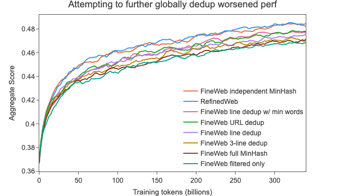
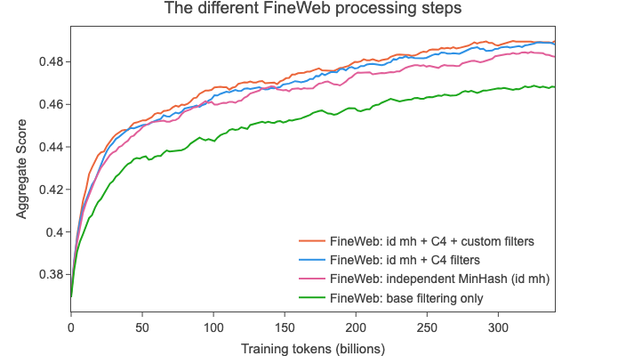
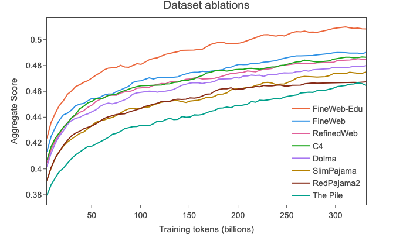
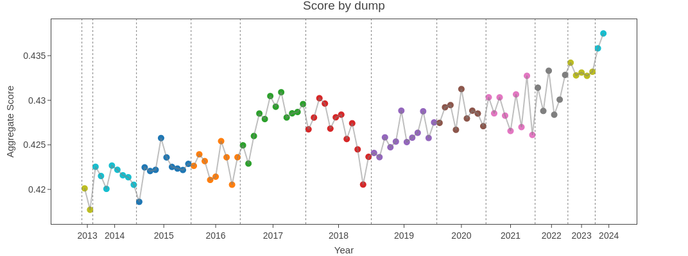

# FineWeb: 웹을 걸러 15조 토큰을 만들기까지

- 원본: Penedo et al., [FineWeb: decanting the web for the finest text data at scale](https://huggingface.co/spaces/HuggingFaceFW/blogpost-fineweb-v1) (HuggingFace 블로그, 2024-05 (보충: 발행월은 본문에 없음); 학술판은 NeurIPS 2024 Datasets & Benchmarks 논문 "The FineWeb Datasets"이며 본문 끝의 인용 정보로만 확인했다). 본문 스스로 "읽는 데 45분"이라고 적은 장문 기술 보고서. 데이터셋(FineWeb 15T, FineWeb-Edu)은 ODC-By 1.0 라이선스로 공개됐고 디스크로 44TB다.
- 정리 방식: 블로그 정적 페이지의 본문 텍스트(약 4만 자)를 받아 정리했다. 그림은 원본을 그대로 옮겨 실었고(출처 표기; 블로그판이라 figure 번호가 없어 그림 제목으로 인용), 파이프라인 도식만 다시 그렸다. 본문의 수치는 전부 원문에서 가져왔다. "(내 해석)"으로 표시한 문장은 정리자의 판단이다.
- 왜 읽는가: [Deep Dive 노트](../../lectures/01-karpathy-deep-dive-llms/notes.md)의 §1.1이 두 문단으로 넘어간 "사전학습 데이터는 어떻게 만드나"를 실제 수준으로 채운다. 검토한 minimind 소스에는 웹 수집·품질 필터링·MinHash 같은 데이터 제작 파이프라인이 없고, 사전학습 코드는 이미 준비된 jsonl을 입력으로 받는다.

## 한 줄 요약

"좋은 데이터"는 육안 검사만으로 항상 판정할 수 없으니 **작은 모델을 학습시켜 벤치마크로 판정**하는 것을 주된 기준으로 삼는다. 그 기준으로 하나씩 실험한 결과가 FineWeb 레시피이고, 그 과정에서 상식과 어긋나는 발견이 둘 있었다. 중복 제거는 많이 할수록 좋은 게 아니었고, LLM으로 "교육적 가치"를 채점해 92%를 버린 FineWeb-Edu는 MMLU에서 C4·Dolma 수준에 이르는 데 토큰이 10분의 1로 충분했다.

## 구조

| 절 | 내용 | 핵심 수치 |
|---|---|---|
| 원료 | Common Crawl: 2007년부터 크롤링, 1~2개월마다 200~400 TiB | 96개 크롤(2013~), 2024-04 크롤은 27억 페이지 386 TiB |
| 처리 도구 | 자체 라이브러리 `datatrove`로 수천 CPU 코어에 확장. 스크립트 공개 | — |
| 품질의 정의 | 1.82B 모델을 각 버전으로 학습해 "early-signal" 벤치마크로 비교 | 대부분 28B 토큰, 확정은 350B 토큰 |
| 텍스트 추출 | WET 대신 WARC에서 trafilatura로 추출 | WET가 25% 더 크지만 품질은 훨씬 나쁨 |
| 기본 필터 | URL 차단, fastText 영어 ≥ 0.65, MassiveText 품질·반복 필터 | 96개 크롤 합쳐 36T 토큰 |
| 중복 제거 | 크롤별 독립 MinHash | 전체 통합 dedup 4T(dedup 전 대비 개선이 거의 없음) → 크롤별 20T(RefinedWeb과 동급) |
| 추가 필터 | C4 필터 일부 + 통계로 찾은 자체 필터 3개 | 최종 15T |
| FineWeb-Edu | Llama-3-70B로 50만 개 채점 → 소형 분류기 → 3점 이상만 | 92% 제거, 1.3T (2점 이상은 5.4T) |
| 보너스 | 크롤마다 품질이 다르고, 2023-14 크롤 이후 ChatGPT 상투어(대리 지표)가 급증 | 192개 모델, 6만+ H100 시간 |

---

## 좋은 데이터는 어떻게 판정하나 {#sec-eval}

이 글에서 가장 중요한 절이다. 나머지 모든 결정이 이 방법 위에 서 있다.

"고품질"은 잘 정의된 말이 아니고, 사람이 문서를 봐서 **항상** 알 수 있는 속성도 아니라고 저자들은 못 박는다. 보고서의 범위도 웹 규모(1,000억 토큰 이상) 사전학습 데이터로 한정한다. 선택지는 셋이다.

1. 위키백과 같은 "깨끗한" 말뭉치로 모델을 학습해 후보 데이터의 perplexity를 잰다. 그런데 이것이 downstream 성능과 항상 상관하지는 않는다.
2. **작은 모델을 후보 데이터로 학습해 벤치마크로 잰다.** 이 글의 선택. 단, 저자들은 이 방법의 위험을 함께 적는다. 특정 벤치마크 하나에 과적합하면 모델의 일반성을 해치므로 다양하고 대표적인 과제 묶음을 써야 하고, 결과는 그 단서를 안고 읽어야 한다.
3. 각 데이터로 모델을 학습해 사람이 출력을 비교한다(LMSYS Arena 방식). 가장 믿을 만하지만 느리고 비싸고, 지시 학습까지 거쳐야 한다.

**Ablation 설정**: 두 버전의 데이터(한 단계를 넣은 것과 뺀 것)로 그 외 조건이 완전히 같은 모델 두 개를 1 epoch 학습해 평균 점수를 비교한다. 모델은 1.82B 파라미터 Llama 구조, 시퀀스 2048, 배치 약 200만 토큰, GPT-2 토크나이저, nanotron으로 학습. 대부분 28B 토큰(이 크기의 Chinchilla 최적 근처)이고 확정 실험은 350B 토큰.

**벤치마크 선정 기준**이 실용적이다. 이 규모에서 신호가 나오는 것만 고른다.

- 같은 데이터의 다른 샘플로 학습해도 분산이 작을 것
- 학습이 진행될수록 점수가 (거의) 단조 증가할 것
- 랜덤 기준선보다 표준편차 몇 개 이상 높을 것

선정 결과: CommonSense QA, HellaSwag, OpenBook QA, PIQA, SIQA, WinoGrande, ARC, MMLU. 평가는 `lighteval`로 하고, 긴 것은 1,000 샘플로 잘라 8 GPU 노드에서 5분 안에 끝낸다.

::: {.callout-note title="minimind 대응"}
minimind README의 평가 절은 C-Eval, CMMLU, ARC-Easy, PIQA, OpenBookQA, HellaSwag, Social-IQa를 lm-evaluation-harness로 돌린다. 이 글의 8개와는 PIQA, OpenBookQA, HellaSwag, SIQA 네 과제와 ARC 계열이 겹친다(minimind는 ARC-Easy, 이 글은 하위 과제를 명시하지 않음). 검토한 minimind README와 소스에는 FineWeb처럼 데이터 처리 단계별 ablation 결과가 없다. 64M 모델은 이 글의 ablation 모델(1.82B)보다 약 28배 작고, README는 결과가 랜덤 근처라고 스스로 적으면서 그 이유로 데이터 양, 중국어 편중, 객관식 포맷 미정렬을 든다(포맷 정렬 LoRA만으로 평균 2.9점이 오른다고도 적는다).
:::

---

## FineWeb 레시피 {#sec-recipe}

{#fig-recipe}

### 텍스트 추출: WET가 아니라 WARC

Common Crawl은 원본 HTML(WARC)과 자체 추출 텍스트(WET)를 제공한다. 많은 데이터셋이 WET에서 시작하지만, 저자들은 WET의 추출이 보일러플레이트와 내비게이션 메뉴를 너무 많이 남긴다고 본다. 그래서 WARC에서 `trafilatura`로 직접 추출했다.

검증: 2019-18 크롤을 두 방식으로 처리(trafilatura는 기본 옵션에 `favour_precision=True`, 둘 다 같은 기본 필터 + MinHash 적용)해 학습하니 WET 쪽이 약 25% 크지만(254B vs 200B 토큰) 품질은 훨씬 나빴다. 단, 추출은 가장 비싼 단계 중 하나라 예산이 적은 팀은 WET를 쓰는 것도 합리적 타협이라고 덧붙인다.

### 기본 필터: RefinedWeb 방식

- URL 차단 목록으로 성인 콘텐츠 제거
- fastText 언어 분류기로 영어 점수 ≥ 0.65만 유지
- MassiveText의 품질·반복 필터(기본 임계값)

96개 크롤 전체에 적용하면 약 36T 토큰(이 글의 토큰 수는 전부 GPT-2 토크나이저 기준).

### 중복 제거: 많이 할수록 좋은 게 아니었다 {#sec-dedup}

**왜 하나**: 웹에는 애그리게이터, 미러, 템플릿 페이지가 많고 크롤러 자체가 같은 페이지를 여러 링크로 받기도 한다. 중복 제거는 성능 향상과 암기 감소에 상관이 있고, 같은 토큰 수로 더 다양한 데이터를 보게 하므로 학습 효율로도 볼 수 있다.

**방법**: MinHash(fuzzy, 해시 기반, CPU 노드로 확장 가능). 문서를 단어 5-gram으로 나누고 해시 함수 112개를 14버킷 × 8개로 묶어, 어느 한 버킷의 8개 해시가 전부 같으면 중복으로 본다. 목표는 75% 이상 유사한 문서. 유사도가 0.7, 0.75, 0.8, 0.85일 때 중복으로 잡힐 확률은 $1-(1-s^8)^{14}$로 각각 56%, 77%, 92%, 98.8%. RefinedWeb은 9,000개 해시(450버킷 × 20)를 써서 경계가 더 날카롭지만 계산·저장 비용이 훨씬 크다. 문서 안의 반복은 기본 필터의 반복 필터가 이미 처리하므로 MinHash는 문서 사이의 중복만 다룬다. 여기서 말하는 dedup은 전부 표면(문자·단어) 수준이고, 같은 내용을 다른 말로 쓴 것을 찾는 의미 수준 dedup은 다루지 않는다.

**첫 시도 (실패)**: "중복 제거는 많을수록 좋다"는 가정으로 90여 개 크롤 전체를 하나로 놓고 제거했다. 최신 크롤(2023-50)부터 시작해 과거로 가며, 각 크롤을 자기 안에서뿐 아니라 앞서 처리한 모든 크롤과 대조했다. 그래서 오래된 크롤일수록 더 많이 지워졌고(가장 오래된 것은 90% 이상), 결과는 4T 토큰. 그런데 350B 토큰으로 학습해 보니 **중복 제거를 안 한 데이터와 거의 차이가 없었고 RefinedWeb보다 한참 낮았다**.

**원인 조사**: 가장 오래된 크롤 2013-48을 따로 봤다. 제거 전 약 490B 토큰, 제거 후 약 31B(94% 삭제). 남은 31B와, 지워진 460B를 따로 독립 dedup한 171B로 각각 28B 토큰씩 학습하니(두 집합 사이에 약 4B 토큰 규모의 유사 문서가 겹칠 수 있다고 저자들은 추정) **지워진 90%가 남긴 10%보다 나았다**. 눈으로 봐도 남은 데이터에 광고, 키워드 목록, 깨진 서식이 훨씬 많았다.

**해법**: 크롤마다 독립적으로 MinHash. 결과 20T 토큰이고 RefinedWeb과 동급 성능. 저자들의 가설은 이렇다. 중복 제거의 이득은 모든 크롤에 나타나는 거대 클러스터(수십만 문서짜리)를 없애는 데서 오고, 중복이 적은(크롤 수인 100개 미만) 문서까지 지우면 오히려 해롭다. 어느 크롤에도 짝이 없는 문서는 품질이 낮거나 분포 밖일 수 있다는 것이다. 저자들은 단서도 단다. 크롤 몇 개를 묶어 dedup하면 이득이 있을 수 있고, 필터 품질이 좋아지면 이 효과가 지금만큼 크지 않을 수 있다.

**측정의 어려움**: 이론적 극단 시나리오(100개 크롤, 각각 완벽히 독립 dedup, 서로는 완전 복제, 각 200B 토큰, 문서 1k 토큰)로 시뮬레이션하면 1B 토큰 샘플에서는 거의 모든 문서가 유일하고, 100B에서야 2회 반복이 다수 생기며, 1T에서 대부분 8회까지 반복된다. 350B에서 평가한 저자들의 결과는 이 시나리오에서 8회까지 반복된 문서를 상당수 포함한다. 즉 큰 클러스터를 제거한 뒤에는 중복 제거의 효과가 작은 슬라이스에서 잘 보이지 않는다.

**다른 전역 방법(모두 실패)**: 독립 dedup한 20T 위에 URL dedup(소문자로 정규화한 URL당 문서 하나만; 71.5% 제거, 5.6T), 줄 dedup(중복 줄 중 무작위 하나만 유지; 77.8%, 4.4T), 10단어 이상 줄만 대상 + dedup 후 3문장 미만 문서 삭제(85%, 2.9T), 3줄 span dedup(숫자를 0으로 정규화해 비교; 80.9%, 3.7T)을 얹어 봤지만 전부 독립 dedup만 한 것보다 나빴다.

{#fig-dedup}

### 추가 필터: C4에서 배우고, 통계로 새로 찾기

독립 MinHash까지로 RefinedWeb과 같아졌지만, 2019년에 나온 C4(약 175B 토큰)가 HellaSwag 등 일부 벤치마크에서 여전히 더 강했다. C4의 필터를 하나씩 FineWeb 2019-18에 적용해 봤다.

- 전부 적용하면 C4의 HellaSwag 점수를 따라잡는다. C4 필터는 단위가 둘이다. javascript·쿠키 고지를 언급하는 줄과 문장부호로 끝나지 않는 줄은 **줄**을 지우고, 길이 범위 밖이거나 "lorem ipsum"·중괄호 `{`를 포함하는 문서는 **문서**를 지운다.
- 중괄호 필터와 단어 길이 필터는 각각 2.8%, 4.3%를 지우며 작은 이득.
- **문장부호로 끝나지 않는 줄 삭제**가 단독으로 가장 큰 이득이지만 토큰의 약 30%를 지운다.
- lorem ipsum, javascript, 쿠키 고지(policy) 필터는 각각 0.5% 미만이라 따로 실험하지 않음.
- "문장부호 필터만 뺀 전부"가 문장부호 필터 단독보다 낫고 약 7%만 지운다. → 이것을 채택.

**자체 필터를 찾는 절차**가 이 글의 방법론적 핵심 중 하나다.

1. 고품질·저품질 웹 데이터 각각에 대해 50개 이상의 통계(줄 수, 평균 줄·단어 길이, 문서 간 반복 지표 등)를 계산한다.
2. 두 분포의 Wasserstein 거리가 큰 지표를 고른다.
3. 히스토그램을 보고 저품질 쪽이 고품질 쪽을 닮게 만드는 임계값을 정한다.
4. 기준 데이터에 적용해 소규모 ablation으로 검증한다.

여기서 "저품질"로는 전역 MinHash 버전, "고품질"로는 독립 MinHash 버전의 2013-48, 2015-22 크롤을 썼다. 예를 들어 "중복 줄에 포함된 문자 비율"은 독립 dedup에서 약 0.005, 전역 dedup에서 약 0.01로 두 배였다. 별개 지표인 "문장부호로 끝나는 줄의 비율"에서는 전역 dedup 쪽이 0.12 부근에 몰려 있었고, 그 임계값으로 지워지는 문서는 짧은 목록이나 "Home", "Sign up" 같은 레이아웃 텍스트뿐인 페이지였다. 후보 17개를 2019-18 크롤에서 28B 토큰 ablation으로 시험해 셋이 살아남았다.

| 필터 | 2019-18 크롤 실험에서 제거된 토큰 비율 |
|---|---|
| 문장부호로 끝나는 줄의 비율 ≤ 0.12인 **문서** 삭제 | 10.14% (C4 원래 필터는 **줄** 단위 삭제로 30%) |
| 중복 줄 문자 비율 ≥ 0.1인 문서 삭제 | 12.47% (MassiveText 원래 임계값은 0.2) |
| 30자 미만 줄의 비율 ≥ 0.67인 문서 삭제 | 3.73% |
| 셋을 함께 | 약 22% |

이 셋으로 C4를 넘어섰고, 데이터는 훨씬 크게 유지했다.

{#fig-steps}

### 최종 FineWeb과 비교

15T 토큰. 350B 토큰으로 학습한 비교에서 RefinedWeb(500B), C4(172B; 앞에서는 175B라고 적는데 원문 자체가 두 값을 쓴다), Dolma v1.6의 CommonCrawl 부분(3T), The Pile(340B), SlimPajama(627B), 중복 제거된 RedPajama2(20T)보다 높은 aggregate 점수를 냈다. 저자들은 "자기들이 아는 한, 수조 토큰 학습이 가능하면서 가장 높은 성능을 내는 공개 데이터셋"이라고 정리한다. 1,000스텝마다의 체크포인트와 평가 결과를 전부 공개했다.

---

## FineWeb-Edu: LLM이 채점한 교육적 가치 {#sec-edu}

Phi-3는 "교육 수준"으로 웹을 걸렀다고, Llama 3는 이전 세대 Llama로 품질 분류기를 만들었다고 밝혔지만 분류기와 데이터는 비공개였다. FineWeb-Edu는 같은 접근(LLM 주석으로 교육적 가치 판별)을 자체 구현하고 분류기와 데이터를 공개한 것이다.

1. **주석**: Llama-3-70B-Instruct로 FineWeb 샘플 50만 개를 0~5점으로 채점. 프롬프트는 Yuan et al.의 가산식 척도(점수를 하나씩 더하며 이유를 말하게 함)가 Likert 척도보다 나았다. arXiv 초록 같은 고도 기술 문서로 쏠리지 않도록 초·중등 수준 지식에 초점을 맞추되, 임계값을 3으로 잡아 고급 자료도 일부 남게 했다. Mixtral 8x7B, 8x22B, 셋의 합의도 시험했지만 Llama 3 단독이 가장 믿을 만했다.
2. **분류기**: 주석을 15T 토큰 전체로 확장하려고 Snowflake-arctic-embed 임베딩 모델 위에 회귀 헤드 하나를 얹어 45만 개로 20 epoch 학습(학습률 3e-4, 임베딩·인코더 동결). Llama 3 주석을 정답으로 삼아 검증 4.5만 개에서 F1이 가장 높은 체크포인트를 고르고, 점수는 0~5 정수로 반올림. 임계값 3 기준 F1 82%. 분류기(`HuggingFaceFW/fineweb-edu-classifier`)와 코드는 공개.
3. **필터링**: 15T 전체에 적용하는 데 H100 6,000시간. 임계값 3이 전체적으로 최선. 더 높이면 지식·추론 벤치마크는 오르지만 HellaSwag과 PIQA가 크게 떨어진다. 이 임계값 비교는 2024-10 크롤 하나에서 1.82B 모델을 8B 토큰만 학습한 작은 실험이라 전체를 대표하지 않을 수 있다. 3점으로 거른 데이터의 개선은 350B 토큰의 긴 실험에서도 대체로 유지됐지만 HellaSwag은 조금 떨어졌다(여러 임계값의 우열을 긴 실험에서 다시 비교한 것은 아니다). 3점 미만을 지우면 92%가 사라지고 1.3T가 남는다.

{#fig-edu}

결과: 350B 토큰 ablation에서 FineWeb과 모든 공개 웹 데이터셋을 넘어섰고, MMLU에서 C4·Dolma와 같은 점수를 내는 데 토큰이 10분의 1로 충분했다. 2점 기준(5.4T)도 공개했다.

저자들은 이것이 "LLM 주석으로 학습한 분류기"가 대규모 필터링에 효과적임을 보인 것이라고 정리한다. (내 해석: LLM을 사전학습 데이터 선별에도 쓸 수 있음을 보인 것이고, Deep Dive 강의에서 라벨링과 환각 완화 데이터 생성에 LLM이 쓰인다고 한 것과 같은 흐름이다.)

---

## 보너스: 크롤은 다 같지 않다 {#sec-crawls}

크롤별로(기본 필터와 MinHash까지 거친 데이터) 1.8B 모델 두 개씩(각 27B 토큰, 다른 샘플) 총 192개를 학습했다(H100 6만 시간 이상). 마지막 3개 체크포인트 6개 점의 평균으로 보면 크롤마다 점수 차이가 뚜렷하다. URL 구성 변화나 벤치마크 오염을 의심했지만 결론을 내지 못했다.

{#fig-dumps}

최근 크롤이 좋은 이유 중 하나로 **합성 데이터**를 의심했다. 감지할 확실한 방법이 없어 대리 지표를 썼다. "delve", "as a large language model", "it's important to note", "rich tapestry", "intertwined", "certainly!", "dive into" 같은 ChatGPT 상투어의 빈도. 2023-14 크롤까지는 거의 일정하다가(ChatGPT는 2022년 말 출시) 그 뒤로 급증했다. 이 상투어가 있다고 전부 ChatGPT가 쓴 것도 아니고 그 반대도 아니라서 어디까지나 대리 지표다. 저자들은 이 관찰만으로 합성 데이터가 품질을 높인다고 결론 낼 수는 없고, 다만 이 규모의 학습에서는 크게 해치지 않는 것으로 보이며 도움이 될 가능성도 있다고 적는다. 훨씬 큰 학습에서도 그런지는 불분명하다.

---

## 읽고 남는 것

- **주요 처리 단계의 효과는 통제된 학습 실험으로 검증한다.** "깨끗해 보인다"가 아니라 1.82B 모델의 벤치마크 점수가 기준이고, 그 벤치마크조차 신호가 나오는지 검증해서 골랐다. 후보를 고르고 설정을 정하는 데는 육안 검사, 분포 통계, 계산 비용도 함께 쓴다. (내 해석: 이 글에서 배울 것은 레시피 자체보다 이 태도다.)
- **저자들의 가정이 실험에 뒤집혔다.** "중복 제거는 많을수록 좋다"는 가정이 그것이고, 그 조사 과정에서 오래된 크롤에서 "살아남은" 10%가 지워진 90%보다 나쁘다는 것까지 드러났다. (내 해석: 이 두 번째 발견이 더 반직관적이다.)
- **비용 감각**: 텍스트 추출은 가장 비싼 단계 중 하나이고, 분류기 적용에 H100 6,000시간, 크롤별 조사에 6만 시간 이상. (내 해석: 데이터 작업은 학습만큼 비싸다.)
- **한계와 이후 계획**: 영어만 다뤘고, 1~2B 모델과 350B 토큰 규모에서의 결론이라 훨씬 큰 학습에 그대로 적용된다고 보장하지 않는다(저자들도 합성 데이터 절에서 같은 단서를 단다). 저자들은 같은 방법을 다른 언어로 확장하고 더 잘 걸러진 부분집합을 공개·재현 가능한 방식으로 계속 내겠다고 밝혔다.

## 이해 확인 질문

1. 왜 perplexity 대신 작은 모델의 벤치마크로 데이터 품질을 판정하는가? 저자들이 명시한 그 방법의 위험은?
2. 전체 통합 MinHash(4T)의 성능이 실망스러웠을 때, 2013-48 실험에서 관찰한 사실은 무엇이고 저자들은 이를 바탕으로 어떤 가설을 세웠는가?
3. 해시 112개(14×8) 설정에서 유사도 0.8인 문서 쌍이 중복으로 잡힐 확률을 식으로 계산하라. 왜 RefinedWeb의 9,000개 설정을 쓰지 않았나?
4. C4의 문장부호 필터를 그대로 쓰지 않고 "문장부호로 끝나는 줄의 비율 ≤ 0.12" 필터로 바꾼 이유는? 제거 비율이 어떻게 달라졌나?
5. FineWeb-Edu 임계값을 3보다 높이면 어떤 유형의 벤치마크가 오르고, 떨어진다고 명시된 두 벤치마크는 무엇인가? 그 실험의 조건은 무엇이고, 350B 토큰 실험은 무엇을 확인한 것인가? (열린 질문, 자기 해석으로) 이것이 "교육적"이라는 기준의 어떤 성격을 드러낸다고 보는가?

## 실습으로 이어지는 지점

- minimind `pretrain_t2t_mini.jsonl`에서 문서 1,000개를 뽑아 이 글의 자체 필터 3개(문장부호 종결 비율, 중복 줄 문자 비율, 짧은 줄 비율)를 계산해 분포를 그려 보기. 중국어 위주의 중·영 혼합이라 임계값은 다르겠지만 지표의 뜻은 같다. 단, 이 jsonl은 통합 학습 형식으로 정리된 것이라 원래 웹 문서의 줄 구조가 보존됐다는 보장이 없다. 줄 기반 지표를 계산하기 전에 `text`의 줄바꿈이 남아 있는지 먼저 확인한다.
- `datatrove` 저장소의 FineWeb 스크립트를 열어 MinHash 단계가 14버킷 × 8해시로 설정되어 있는지 확인하기.
- HuggingFace의 `fineweb-edu-classifier`를 받아 아무 웹 문서 몇 개에 점수를 매겨 보고, 3점 경계의 문서가 어떤 것인지 눈으로 보기.
